# Battle UI Visual Guide

This document is the battle-mode companion to the
[Quest Prototype Visual UI Guide](ui_visual_guide.md). Battle mode is by far the
most complex part of the prototype — a full card game with its own board, phases,
zones, overlays, and a developer Inspector — so it lives in its own document. The
quest/meta screens (Dreamcaller Selection, Dream Atlas, sites, deck viewer, etc.)
are documented in the main guide; everything that happens during or around a
match is documented here.

Conventions are the same as the main guide: each screen or complex sub-UI is its
own top-level (`#`) section; screenshots are captured at 1920×1080; the guiding
question for each is "what can you click or hover here, where is it, and what
does it do?". Developer/debug surfaces are documented but flagged as things that
should become their own separate screens in a mobile redesign rather than panels
crowded onto the live board.

A battle has two top-level screens — **Battle Start** (the pre-match intro) and
the **Battle Board** (the live match) — plus a family of overlays, drawers, and
panels the board raises: the Dreamwell card display, the card zone browser, the
card picker and choice prompt, the Foresee overlay, the deck-order picker, the
right-click context menu, the battle-log and Dreamwell-history drawers, the
card-hover preview, the Dreamcaller/dreamsign hovers and panel, the
end-of-battle result/reward surface, and the developer surfaces (Inspector,
Figment creator, card-note editor). Each is documented in its own section below.

---

# Battle Start (Pre-Battle Intro)

**What it does.** Shown when the player arrives at a Battle site, before the match
begins. Its job is to introduce the opposing Dreamcaller — its abilities,
signature cards, and any dreamsigns — and state the stakes (score to win, essence
reward) so the player can scout the fight before committing to it. Clicking
through starts the match.

**Layout.** A cinematic split composition rendered over the dreamscape's scene
art, dimmed for contrast:

- **Left:** the enemy Dreamcaller's **full-body figure**, lit with ambient
  particle/glow effects, occupying the left half (intended to be the animated 3D
  model in its "card" presentation).
- **Right:** a text column, top to bottom:
  - the enemy Dreamcaller's **name** (e.g. "Seraveth", large serif) and
    **title/subtitle** beneath it (e.g. "Twice-Mourned", italic);
  - an **"ABILITY"** label and the Dreamcaller's **rules text**, with keyword
    terms (e.g. "reclaim") highlighted inline;
  - a **"SIGNATURE CARDS"** label and a **row of 3 face-up card thumbnails**;
  - a stats line pairing the **score to win** for this battle (e.g. "10 to win")
    with the **essence reward** (e.g. "100 essence"), each with its glyph;
  - a primary **"Begin Battle"** button (purple, glowing) below the stats.
- If the opponent carries **dreamsigns** (from the run's midpoint onward), those
  are surfaced here as well so the player can see the opponent's passive effects.

In portrait the figure moves to the top and the text column flows beneath it.

**What you can click:**

- **Begin Battle** — starts the match. The camera transitions from this intro to
  the battle board: the enemy Dreamcaller animates to its battle position (small
  head-only card), both decks and the player's Dreamcaller animate to their
  starting spots, and opening hands are dealt to both sides. This is the single
  forward action on the screen.

**What you can hover / long-press:**

- **The ability text** → glossary term definitions, as on the Dreamcaller select
  screen and on cards.
- **Each signature card thumbnail** → an enlarged card preview with full art and
  rules text.
- **Any opponent dreamsign** (when present) → the full dreamsign card on hover.

**Redesign notes.** This screen is mostly presentational and translates to mobile
relatively cleanly. The key content to preserve is the *scouting* function — ability,
signature cards, dreamsigns, and the win/reward stakes must all be legible before
the player commits, and the card/dreamsign detail currently locked behind hover
needs a tap equivalent.

---

# Battle Board (In-Battle)

**What it does.** The live card match, played under the rules in
[battle_rules.md](../../battle_rules/battle_rules.md). The board is **symmetric**:
the two sides mirror each other around a central battlefield, with the local
player anchored at the bottom and the opponent at the top. By default a local AI
drives the opponent and "Basic Automation" handles routine rules bookkeeping, so
the player mostly plays cards and advances phases. This is by far the most complex
and information-dense screen in the app.

> **Screenshot note:** the capture above has the developer **Inspector** open
> along the right edge, which compresses the board. The Inspector is a debug
> surface (detailed at the end of this section) and is **not part of the
> player-facing battle** — picture the board widened to fill the space it
> occupies.

**Top chrome — the Status Bar.** A bar across the very top carries the global
match state: the **turn / round number** ("Turn 1"), a **phase rail** naming the
turn's phases — **DREAMWELL · DAY · DUSK · NIGHT · CHALLENGE** — with the current
phase highlighted, and both sides' **scores** (points toward the win threshold).
The active phase advances through this sequence; in manual mode the phase names
act as controls to set the phase. When the AI opponent's side is active, a small
**"AI thinking…"** indicator (an animated pulsing dot + label) appears at the
right end of the status bar, beside the score readout — distinct from the
fuller AI proposal banner below the bar. A screen-reader live region (not
visible) announces "<side> Turn N <Phase>" as state changes.

**AI proposal banner.** Just under the status bar, a slim banner appears while the
AI opponent holds an un-approved move ("AI proposes: …") or is computing one
("AI · Thinking…"). While a proposal is held, the player's own board controls are
locked and the human acts only through the approve/reject icons in the phase
cluster (see below). The banner renders nothing on the human's own turn.

**Central battlefield (top → bottom).** The middle of the screen is the shared
battlefield, stacked as opposing ranks:

- **Enemy back rank**, then **enemy front rank** (the opponent's character slots);
- a **judgment divider** line across the middle that lights up ("active") during
  the **Challenge** phase, when opposing front ranks fight;
- **player front rank**, then **player back rank** (the local player's slots).

Each rank is a row of card slots; characters are played into slots and can be
repositioned. Above the battlefield, during the Dreamwell phase (turn 2+), the
current **Dreamwell card** for the active side is shown centered (the card that
ramps energy / draws for the turn).

**Side columns (flanking the battlefield).** To the left and right of the
battlefield sit two **side-zone columns**, one per side, each containing:

- a **Void** and a **Banished** small-zone button, each showing a count; clicking
  one opens that zone's full **card browser**, and cards can be dragged onto them;
- a **Status Strip** for that side showing the side's **Dreamcaller portrait**
  (name + title), **energy** (current/max — the resource for playing cards),
  **score**, and a **Draw Card** control, with the active side highlighted.
  The Dreamcaller portrait carries a small **hand-count badge** (a card glyph +
  number) in its corner showing how many cards that side holds. Clicking the
  portrait opens that side's **summary popover** (Dreamcaller ability +
  dreamsigns). The strip also exposes per-side energy/score/draw steppers used
  for manual play and debugging.

**The player's hand.** A **hand tray** runs along the bottom: the local player's
cards fanned/rowed face-up, showing each card's cost and art. With Basic
Automation on, cards whose effect is auto-handled carry a small **automation
gear icon** overlaid on the card, marking them as ones the system will resolve
for you. (A debug mode can hide the player's hand and/or reveal the opponent's
hand in a tray at top.)

**On-card markers and note chips.** Cards on the battlefield (and in hand) can
carry small **chips** rendered on the card itself: a red **"Prevented"** marker
(shield icon) and a blue **"Copied"** marker (duplicate icon) reflect rules
state set during play, and **developer note chips** (amber, truncated text with
an optional expiry hint like "T4") show notes attached via the card context
menu. When a card has more than three notes a **"+N more"** overflow chip
appears. Clicking a note chip opens that note in the card-note editor.

**On-card state indicators.** Beyond the chips above, the card render itself
encodes several pieces of live rules state directly on the face of the card:

- **Spark coloring** — a character's spark value is tinted when its *effective*
  spark differs from its printed spark: it reads as **boosted** when raised and
  **nerfed** when lowered, so a buffed or debuffed character is legible at a
  glance without opening the card.
- **Exhausted glyph** — an exhausted character shows a small **☪ moon glyph** over
  its art, marking it as tapped/spent for the turn (Basic Automation clears
  exhaustion at Dawn).
- **Figment-count badge** — a character carrying more than one stacked figment
  token shows a small numeric badge with that count.
- **Counter badge** — a card holding stored counters shows a **⧗ glyph followed by
  the count** in its corner.
- **Hidden face** — a card the local player may not see (the opponent's hand cards
  in normal play, or either hand in the relevant debug-view mode) renders
  face-down: its cost, spark, name, and type all show as **"?"** and its art is
  suppressed.

**Support highlighting.** While positioning characters, battlefield slots that a
back-rank character *supports* (the front-rank slots it passively boosts) are
**highlighted** on the board, so the player can see which slots a support
relationship covers.

**Bottom Action Bar.** Below the hand, a row of controls: **Undo / Redo**, a
**Basic Automation** on/off gear toggle, a **Battle Log** toggle (opens a
side drawer of the full command history), a **Dreamwell History** toggle (the
drawer of revealed Dreamwell cards), and the **Inspector** toggle.

**What you can click / interact with (player actions):**

- **Cards in hand** — double-click (or drag) plays a card to the battlefield,
  paying its energy cost (automation routes events to the void and spends energy);
  right-click opens a context menu of card actions; hover shows an enlarged
  preview.
- **Battlefield characters** — drag to reposition/swap slots; drag cross-side or
  to a zone to move; right-click for the context menu; hover for the enlarged
  card preview.
- **Phase controls / phase rail** — advance the turn. Much routine work
  (spending energy, ramping/drawing at start of turn, clearing exhaustion at
  Dawn, resolving the Challenge, enforcing the hand limit, advancing bookend
  phases) is handled automatically by Basic Automation; with it off, every step
  is manual.
- **The AI approve / reject icons** (in the phase cluster) — when the AI holds a
  proposal, a check **approves** it (committing it to shared state) and a cross
  **rejects** a proposed card play.
- **Void / Banished zones** — click to open a zone's card browser; drop
  cards onto them to move cards there.
- **Side Status Strip portrait** — opens the side's Dreamcaller/dreamsign summary.
- **Action Bar buttons** — Undo, Redo, toggle Automation, Battle Log, Dreamwell
  History, Inspector.

**Overlays this screen can raise** (each a modal/drawer over the board): the
**zone browser** (full contents of a void/banished/deck zone), a **card picker**
and a **choice prompt** (for effects that ask the player to pick cards or choose
an option), a **Foresee** overlay (look at / reorder the top of a deck), a
**deck-order picker**, the **side summary** popover, the **Dreamcaller panel**,
the **Battle Log** and **Dreamwell History** drawers, and finally the
**result/reward overlay** when the battle ends (Victory shows the reward surface;
Defeat shows the result overlay with a reset path — see the
[Battle Result & Reward](#battle-result--reward) section).

> **Developer surfaces on this screen** (each should be its own separate screen
> on mobile, not an inline panel): the **Battle Inspector** (right-edge drawer —
> documented in its own section below), the **right-click card context menu**
> (per-card debug actions and card notes), and the board's manual
> energy/score/phase steppers built into the status strips for hand-driven/debug
> play. The intended player-facing battle is the status bar + phase rail, the
> symmetric battlefield, the side status strips (score/energy), the hand tray, and
> the minimal action bar — everything else is developer tooling.

**Redesign notes.** This is the hardest screen to fit to portrait: it must
simultaneously present two mirrored multi-rank boards, two side columns of
resources and zones, a phase timeline, the hand, and an action bar.
The developer Inspector currently consumes roughly a third of the width and
should be removed from gameplay-layout consideration entirely (re-homed to a
separate debug screen). The persistent "chrome" a mobile layout must keep
glanceable is small but essential: whose turn / which phase, both scores, and the
active side's energy and hand. The biggest spatial tension is that a symmetric
top-vs-bottom board plus a bottom hand and bottom action bar all compete for
vertical space on a phone; the side columns (zones + status strips) have no
natural home in a narrow layout and will likely need to collapse into
tap-to-open chips.

---

# Dreamwell Card Display

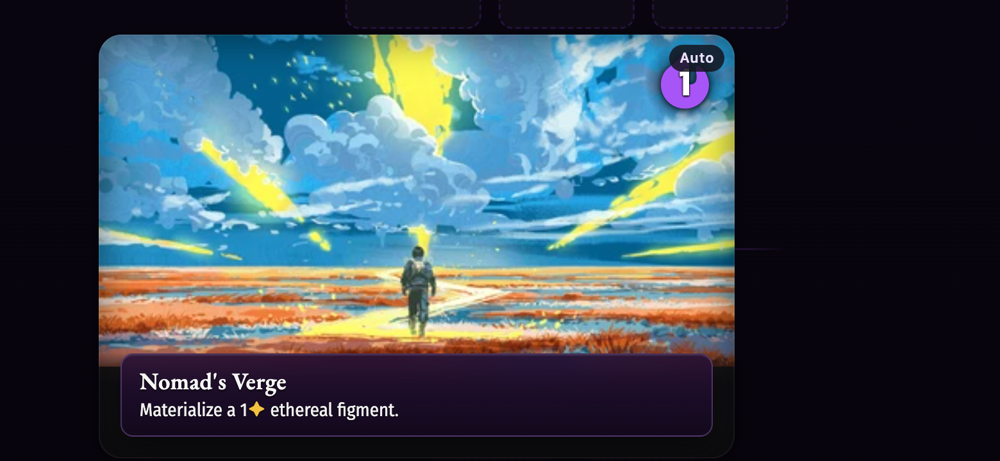

**What it does.** At the start of each turn from turn 2 onward, the active side's
**Dreamwell card** is revealed and shown centered above the battlefield during the
Dreamwell phase. The Dreamwell is the shared energy/draw engine: each revealed
card ramps the side's energy (and some cards carry an extra scripted effect). This
display is how the player sees which Dreamwell card came up this turn.

**Layout.** A single wide, landscape-format card floats above the battlefield
while the phase rail shows **DREAMWELL** active. The card shows its art, its
**name** (e.g. "Nomad's Verge"), and its **effect text** (e.g. "Materialize a
1⬢ ethereal figment"). A badge in the top-right corner reads **"Auto"** with the
**energy number** it adds (here "1"), indicating the card's energy is applied
automatically by Basic Automation. The first round surfaces no Dreamwell card, so
the display appears only from turn 2 on.

**What you can click / hover.** The central card is primarily a reveal, not a
control: under Basic Automation its energy (and any deterministic effect) is
applied automatically and the phase auto-advances. Cards that carry an
interactive effect (for example "draw, then discard") raise a separate prompt
overlay — see the Card Picker and Foresee sections. The full Dreamwell deck and
its revealed history can be opened from the Action Bar's **Dreamwell History**
drawer.

**Redesign notes.** This is a brief, high-attention moment (the turn's "what did
I draw from the well") and needs to be glanceable and then get out of the way. On
mobile the wide card format competes with the board for the center of the screen;
the energy/Auto badge is the one piece that must stay legible.

---

# Card Zone Browser (Deck / Void / Banished)

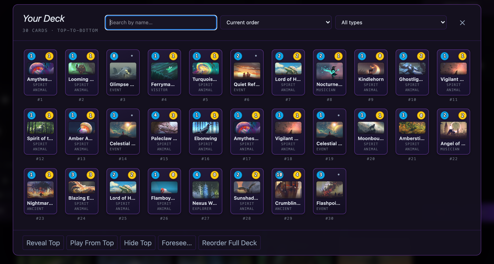

**What it does.** The zone browser is a single reusable modal for inspecting the
full contents of a card zone — a side's **deck**, **void**, or **banished** pile.
It is opened by clicking a zone's count chip on the board (Void / Banished) or via
the Inspector's "Open Deck". The same component renders all three zones; only the
title and contents differ.

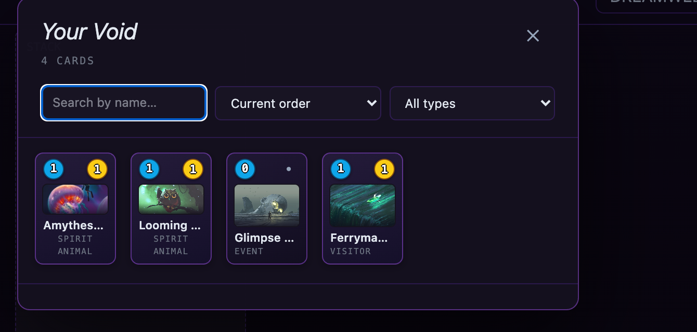

**Layout.** A titled panel ("Your Deck", "Your Void", etc.) with a **card count**
subtitle, then a control row — a **search-by-name** box, a **sort** dropdown
("Current order"), and a **type filter** dropdown ("All types") — and an **✕**
close. Below is a scrolling **grid of card tiles**; each tile shows the card's
energy-cost orb, spark value, name, and type (and, for an ordered deck, a `#`
position index). The deck variant adds a row of zone-specific action buttons along
the bottom — **Reveal Top**, **Play From Top**, **Hide Top**, **Foresee…**, and
**Reorder Full Deck**. The deck browser appears centered; the void/banished
browsers anchor near their zone (top-left/top-right) and are more compact.

**What you can click:**

- **The search box / sort / type filter** — narrow and reorder the visible cards.
- **A card tile** — select it (and, depending on zone, drag it elsewhere or open
  its actions).
- **Bottom action buttons** (deck) — Reveal Top, Play From Top, Hide Top, open
  **Foresee** on the deck, or **Reorder Full Deck** (opens the deck-order picker).
- **✕ close** — dismiss the browser.

**What you can hover:** each card tile enlarges to a full card preview with its
rules text.

**Redesign notes.** This is a clean, self-contained browser that maps well to a
mobile full-screen sheet. The search/sort/filter controls and the per-zone action
row are the parts to preserve; the card grid is the kind of dense element a phone
handles fine as a vertical scroll.

---

# Card Picker (Choose / Discard a Card)

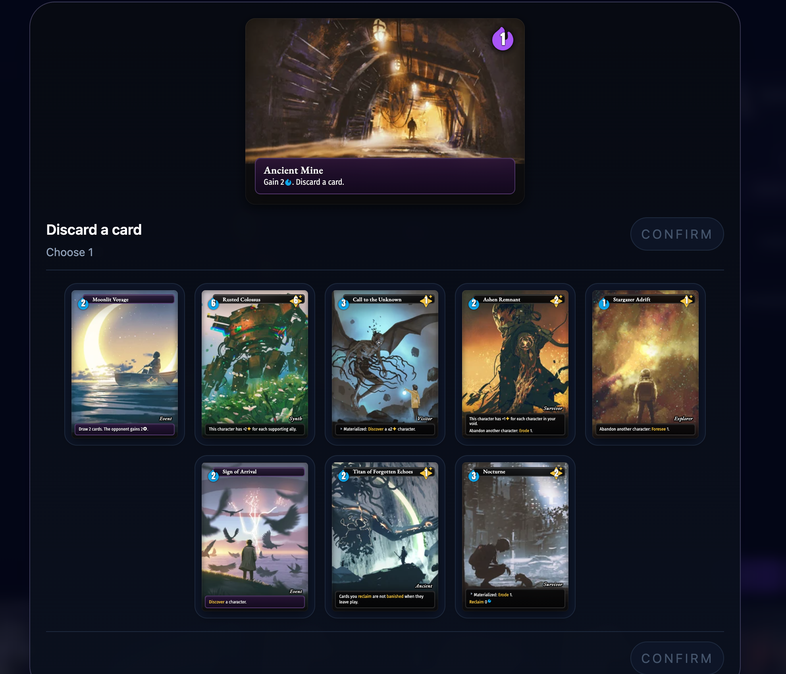

**What it does.** The card picker is the modal that asks the player to pick one or
more cards from a set — for example "Choose a card to discard", "Discard 2 cards",
or "Reveal three matching cards and choose one to draw". It is raised by card and
Dreamwell-card effects that require a choice (the screenshot shows the Dreamwell
card "Ancient Mine — Gain 2⬢. Discard a card." driving a discard pick). It blocks
the board until resolved.

**Layout.** A centered modal over a dimmed board. At the top sits the **source
card** that triggered the prompt (its art + name + effect), so the player knows
why they are choosing. Below is the **prompt label** ("Discard a card") and a
**"Choose N"** count line, with a **CONFIRM** button (disabled until a valid
selection is made; a **Skip** appears instead when the prompt is optional). The
body is a **grid of candidate cards** to choose from; for a "draw" variant the
freshly-relevant card may be highlighted.

**What you can click:**

- **A candidate card** — toggle its selection (up to the required count).
- **CONFIRM** — commit the selection and apply the effect (discard / draw / etc.).
- **Skip** — decline, when the prompt is optional.

**What you can hover:** candidate cards enlarge to show full art and rules text.

**Redesign notes.** This is a focused, blocking decision and is one of the better
candidates for a clean mobile sheet: source card up top, a scrollable candidate
grid, and a single confirm. The count requirement and the disabled-until-valid
confirm are the interaction details to preserve.

---

# Foresee Overlay

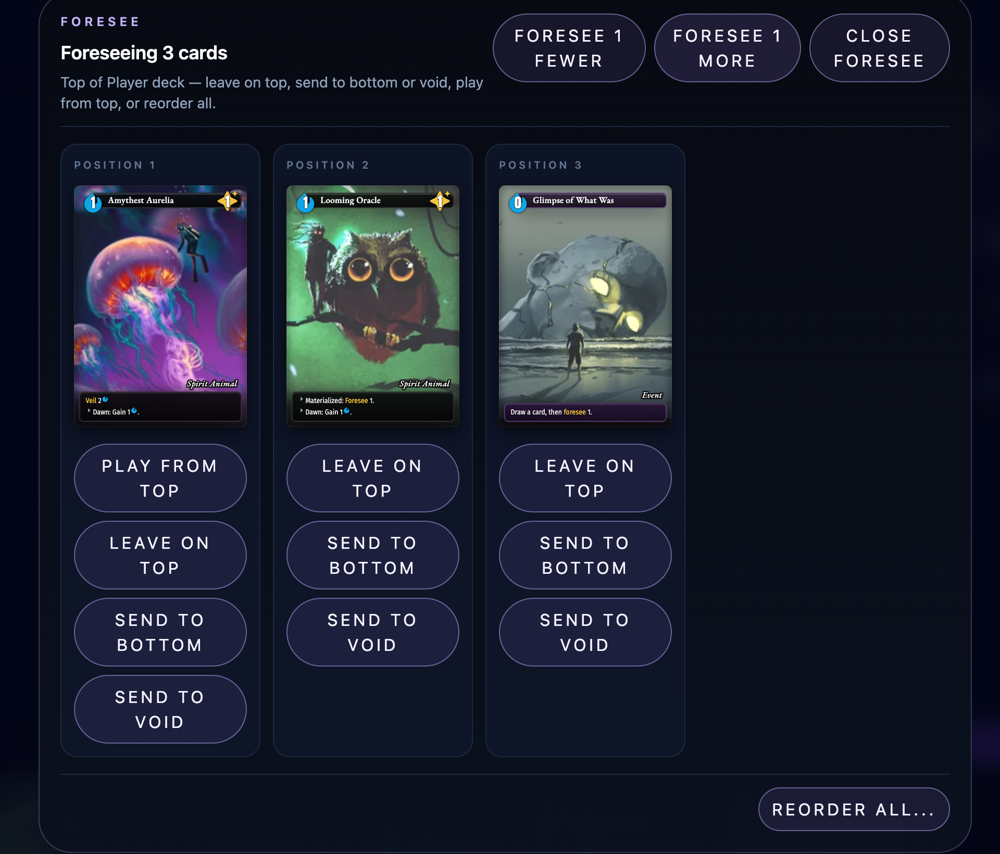

**What it does.** Foresee lets the player look at the top N cards of a deck and
decide what to do with each — leave on top, send to the bottom, send to the void,
or play from the top — and optionally reorder them all. It is raised by Foresee
effects, by the Inspector's per-side "Foresee" tool, and from the deck browser's
"Foresee…" action.

**Layout.** A centered modal headed **"Foreseeing N cards"** with a one-line
explanation ("Top of <side> deck — leave on top, send to bottom or void, play
from top, or reorder all"). Top-right are a **FORESEE 1 FEWER** / **FORESEE 1
MORE** pair (adjust how deep to look) and **CLOSE FORESEE**. The body shows the
top cards in order, each in a labeled **Position 1 / 2 / 3** column with its full
art and a stack of per-card action buttons: **Play From Top**, **Leave On Top**,
**Send To Bottom**, **Send To Void**. A **REORDER ALL…** button (bottom-right)
opens the full deck-order picker for finer control.

**What you can click:**

- **FORESEE 1 FEWER / MORE** — change how many top cards are shown.
- **A per-card action** (Play From Top / Leave On Top / Send To Bottom / Send To
  Void) — resolve that card.
- **REORDER ALL…** — open the deck-order picker to arrange the whole set.
- **CLOSE FORESEE** — finish.

**What you can hover:** each shown card is full size already; hovering enlarges it
further with rules text.

**Redesign notes.** Foresee is a per-card decision over a small ordered set — it
translates to mobile as a vertical list of cards each with its action buttons. The
"1 fewer / 1 more" depth control and the per-card destination buttons are the core
interactions; the wide multi-column layout is the part that needs rethinking for a
narrow screen.

---

# Card Context Menu (Right-Click)

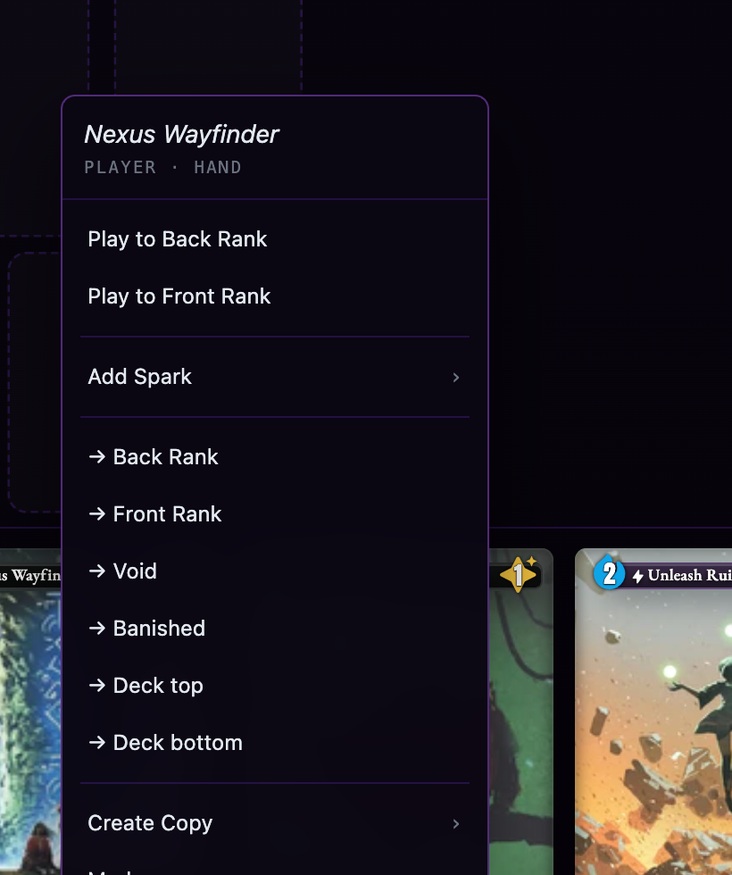

**What it does.** Right-clicking (or long-pressing) any card — in hand, on the
battlefield, or in a zone browser — opens a context menu of actions
for that specific card. It is primarily a **developer/manual-play** tool: it
exposes direct moves and edits that bypass the normal rules flow, useful for
setting up board states and debugging. In a mobile redesign this might be a long
press activation or other secondary/hidden gesture.

**Layout.** A small floating menu anchored at the cursor, headed by the **card
name** and its current location (e.g. "Nexus Wayfinder — PLAYER · HAND"), then a
list of actions grouped by kind:

- **Play to Back Rank / Play to Front Rank** — play the card to a rank.
- **Add Spark ›** — a submenu to adjust the card's spark.
- **→ Back Rank / → Front Rank / → Void / → Banished / → Deck top / → Deck
  bottom** — move the card directly to any zone (no cost, no rules checks).
- **Create Copy ›** — duplicate the card.
- **Markers / Status / Counters ›** — submenus for card markers, status, and
  counters.
- **Add Note…** — attach a developer note to the card (opens the note editor).

**What you can click:** every row is an action; rows marked **›** open a submenu.
Clicking outside the menu dismisses it.

---

# Dreamcaller & Dreamsign Hovers

Each side's **Dreamcaller** and the player's **Dreamsigns** are surfaced in the
battle through two hover affordances. Both put information that is otherwise
off-screen one hover (or long-press) away.

**Side summary (Dreamcaller + Dreamsigns).**

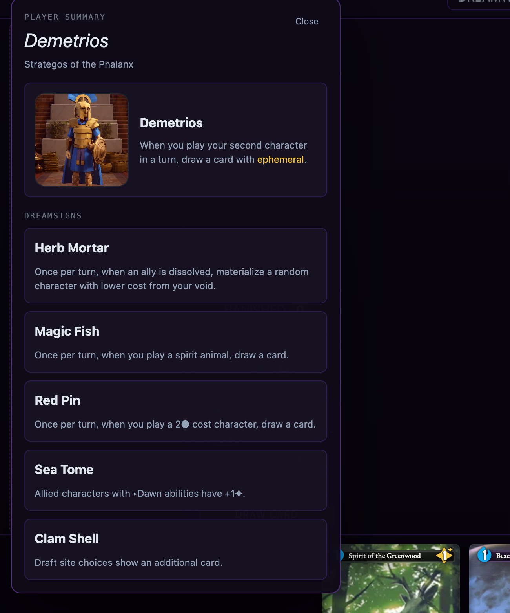

Hovering (or focusing) a side's **Dreamcaller portrait** in its Status Strip
raises a **side-summary popover** for that side. It is headed "PLAYER SUMMARY" /
the opponent's name, with the Dreamcaller's **name and title**, a **Close**, the
**Dreamcaller card** (portrait + full ability text), and a **DREAMSIGNS** section
listing every dreamsign that side carries — each with its name and full effect
text. This is the one place in battle to read a side's complete passive setup
(its Dreamcaller ability plus all dreamsigns) at once.

**Dreamsign thumbnail hover.**

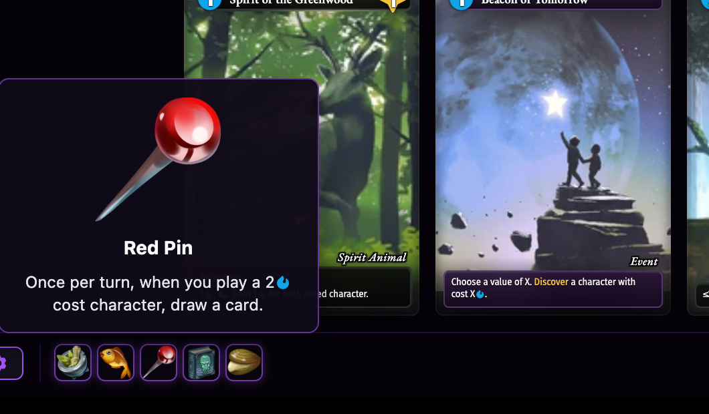

The player's dreamsigns also appear as a row of small **art thumbnails** in the
Action Bar (bottom-left). Hovering one raises a **dreamsign hover card** showing
the dreamsign's larger art, its **name** (e.g. "Red Pin"), and its full **effect
text** ("Once per turn, when you play a 2⬢ cost character, draw a card"). This is
the same hover card used by the dreamsign row on the quest HUD.

**What you can click / hover:**

- **Hover/focus a Dreamcaller portrait** (in the Status Strip) → the side-summary
  popover (Dreamcaller ability + all that side's dreamsigns).
- **Hover a dreamsign thumbnail** (in the Action Bar) → that dreamsign's hover
  card.

**Redesign notes.** All of this is reference information delivered only on hover,
so it needs a touch-first equivalent (tap-to-open the side summary; tap a dreamsign
to expand it). The side-summary popover is essentially a per-side "passives sheet"
and is a natural fit for a tap-to-open panel on mobile.

---

# Choice Prompt Overlay

**What it does.** The choice prompt is the **yes/no-or-pick-an-option** modal
raised by card and Dreamwell-card effects that offer a decision rather than a card
selection — for example "Discard 2 cards, then draw 2?", "Abandon a character to
draw 2?", "Play a character from your void?", or "Discard your hand and redraw?".
It is the sibling of the [Card Picker](#card-picker-choose--discard-a-card): the
Card Picker asks *which cards*, the Choice Prompt asks *whether / which option*.
Like the Card Picker it blocks the board until resolved, and (because a choice is
required) Escape and backdrop clicks do nothing.

> **Note:** this overlay is raised only by specific "may"-style Dreamwell/card
> effects whose appearance depends on the shuffled Dreamwell order, so it was not
> reliably reproducible to screenshot in a QA session. Its layout is the same
> modal family as the captured Card Picker above (source card at the head, then
> the prompt), differing only in the body.

**Layout.** A centered modal over a dimmed board. At the head sits the **source
card** that triggered the prompt (the Dreamwell/card driving the choice), then the
**prompt title** (the question), then a vertical stack of **option buttons** — for
a yes/no effect, the options are the two outcomes; for a multi-way effect, one
button per option. There is no separate cancel/confirm: choosing an option *is*
the resolution.

**What you can click:** exactly one **option button**, which commits that choice
and applies the effect.

**Redesign notes.** This is a small, blocking decision and is among the easiest
surfaces to bring to mobile: source card on top, a question, and a short column of
big tap targets. The "no escape / a choice is required" behavior should be
preserved so the game state cannot be left mid-resolution.

---

# Deck Order Picker

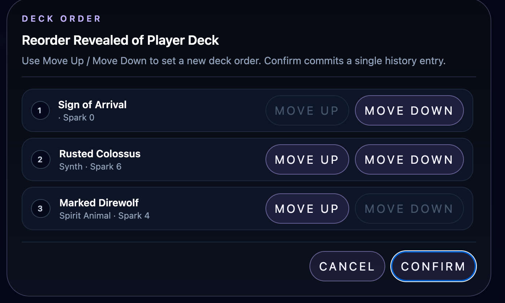

**What it does.** The deck-order picker is the modal for arranging cards into a
specific order — either the **full deck** ("Reorder Full Deck" from the zone
browser) or the **revealed subset** from a Foresee ("Reorder All…"). It commits
the new order as a single history entry.

**Layout.** A modal headed "DECK ORDER" with a scope title ("Reorder Revealed of
Player Deck" / "Reorder Full …") and the instruction "Use Move Up / Move Down to
set a new deck order. Confirm commits a single history entry." Below is a numbered
**ordered list of cards** (each row: position number, card name, type/spark) with
**MOVE UP** and **MOVE DOWN** buttons (disabled at the ends), and a **CANCEL** /
**CONFIRM** pair at the bottom.

**What you can click:**

- **MOVE UP / MOVE DOWN** on a row — shift that card one position.
- **CONFIRM** — apply the new order (one history entry).
- **CANCEL** — discard changes.

**Redesign notes.** Move-up/move-down reordering is verbose; a mobile design might
prefer drag-to-reorder. The scope label (full vs. revealed) matters and should
stay visible so the player knows how much of the deck they are arranging.

---

# Battle Log Drawer

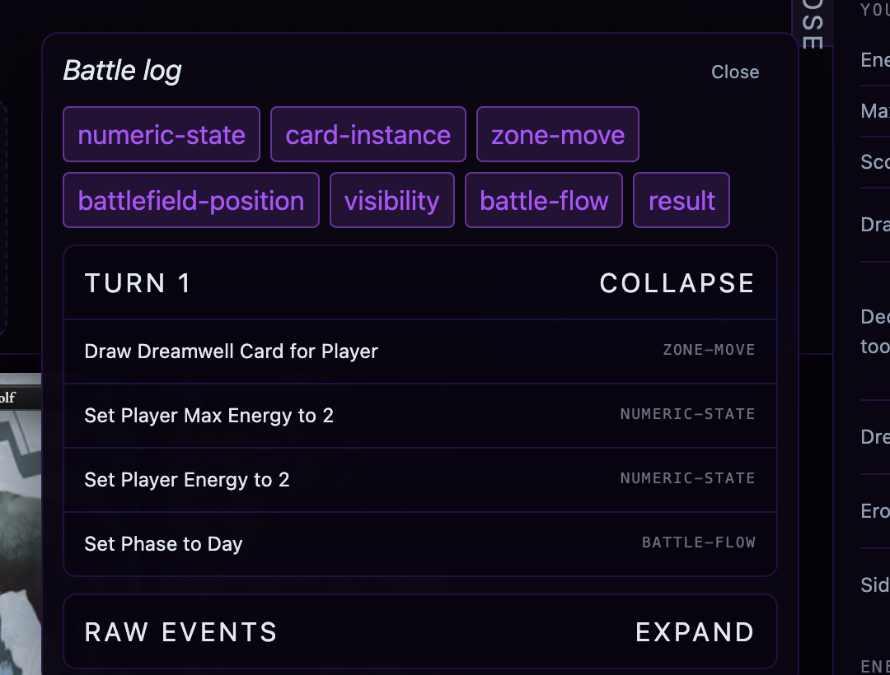

**What it does.** The Battle Log drawer is a chronological record of everything
that has happened in the match — the command/event history that backs Undo/Redo.
It is opened from the Action Bar's **Log** toggle and is primarily a
debugging/inspection surface.

**Layout.** A panel headed "Battle log" with a **Close**, a row of **category
filter chips** (numeric-state, card-instance, zone-move, battlefield-position,
visibility, battle-flow, result) that toggle which event kinds are shown, and the
log itself grouped by turn ("TURN 1 … COLLAPSE") with one row per event (a
human-readable description plus its category tag, e.g. "Draw Dreamwell Card for
Player — ZONE-MOVE"). A **RAW EVENTS / EXPAND** section at the bottom exposes the
underlying raw event stream.

**What you can click:** the **category chips** (filter), the per-turn
**COLLAPSE/EXPAND** toggles, the **RAW EVENTS Expand**, and **Close**.

**Redesign notes.** This is an inspection tool, not core play; on mobile it should
be a separate, openable panel/sheet rather than always-present chrome. The
category filters and turn grouping are the useful structure to keep.

---

# Dreamwell History Drawer

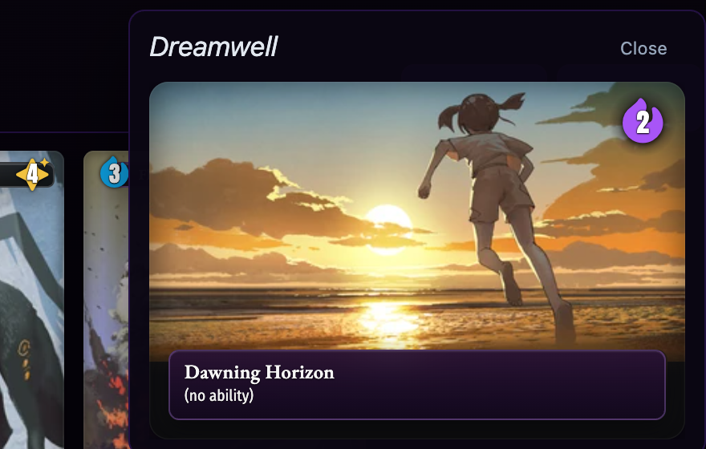

**What it does.** A scrollable history of every Dreamwell card drawn so far this
battle, most-recent-first. Both sides draw from one shared, pre-shuffled Dreamwell
deck, so this is the record of what has been revealed. Opened from the Action
Bar's **Dreamwell** toggle.

**Layout.** A panel headed "Dreamwell" with a **Close**, then a vertical list of
the revealed Dreamwell cards (each shown as its card with name, effect, and energy
badge). Because it tracks live state, Undo/Redo grows/shrinks the list in lockstep
with the board.

**What you can click / hover:** **Close**; each card can be hovered for a larger
view.

**Redesign notes.** A simple reference list; maps cleanly to a mobile sheet. Its
value is letting the player reason about the shared Dreamwell sequence, so keeping
draw order and energy values legible is what matters.

---

# Card Hover Preview

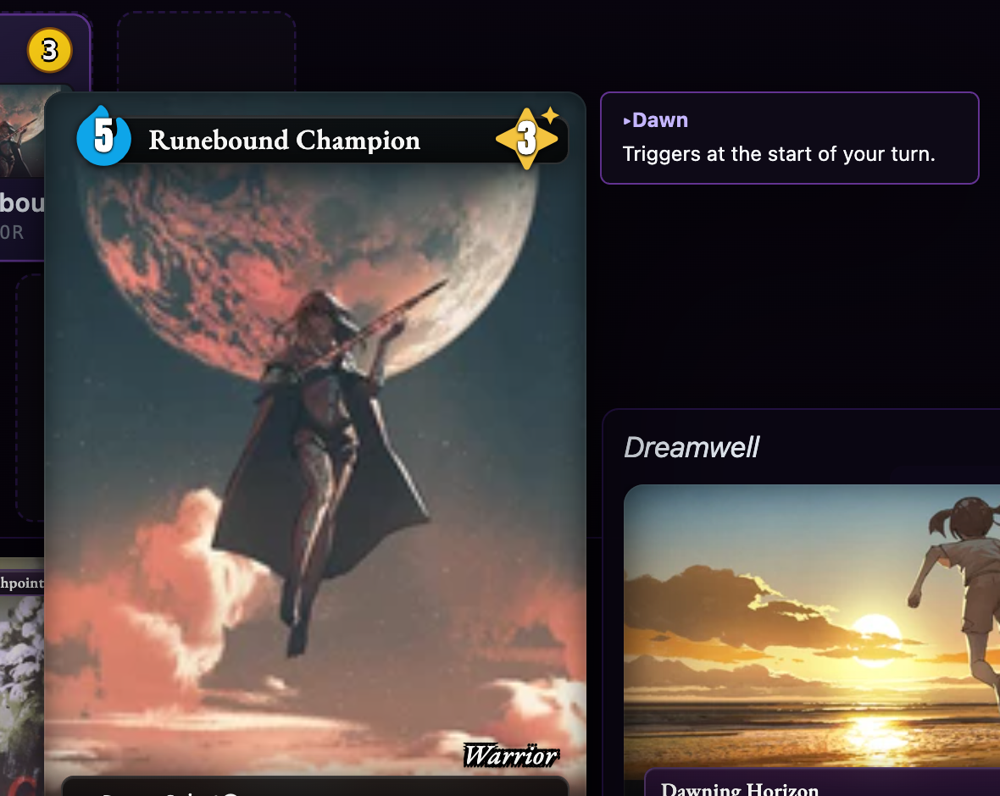

**What it does.** Hovering (or long-pressing) any card on the battlefield or in a
zone browser raises an enlarged **card preview** floating near the
pointer, alongside a **term-definitions panel** that explains the glossary
keywords in that card's rules text. This is the pervasive "read this card closely"
affordance used throughout the battle.

**Layout.** A large rendering of the card (full art, cost, spark, name, type, and
rules text) with, to one side, a small panel listing each glossary term the card
uses and its definition (e.g. "▸Dawn — Triggers at the start of your turn"). It
follows the pointer and flips to stay on screen.

**What you can hover:** any battlefield or zone card. (Hand cards have their own
in-tray enlarge-on-hover behavior.)

**Redesign notes.** This is the primary way players read card detail mid-battle, so
a touch equivalent (tap-and-hold, or tap-to-open a card sheet) is essential. The
paired term-definitions panel is a strong feature worth preserving — it puts rules
clarifications right next to the card instead of in a separate glossary.

---

# Dreamcaller Panel

**What it does.** A full-panel view of a battle side's Dreamcaller — its portrait,
ability text, and the side's dreamsigns (with bane badges). It is a larger,
dedicated counterpart to the hover side-summary popover (see
[Dreamcaller & Dreamsign Hovers](#dreamcaller--dreamsign-hovers)).

> **Note:** this component exists in the battle code but is **not currently wired
> to any open trigger** in the running UI (no on-screen control opens it), so it
> could not be captured live. It is documented here for completeness; functionally
> it duplicates the side-summary popover at a larger size.

**Layout.** A centered floating panel over a scrim, headed "Battle Side / name /
title / Close", with a large **Dreamcaller card** (portrait + full ability text)
and a **Dreamsigns** section listing each dreamsign (name + effect, with a "Bane"
badge for banes; "No active Dreamsigns" when empty).

**What you can click:** **Close** (or the scrim) to dismiss.

**Redesign notes.** Since the hover side-summary already covers this content, a
mobile design likely wants one canonical "side detail" surface rather than both;
this panel's larger card-forward layout is the better starting point for a
tap-to-open sheet.

---

# Battle Result & Reward

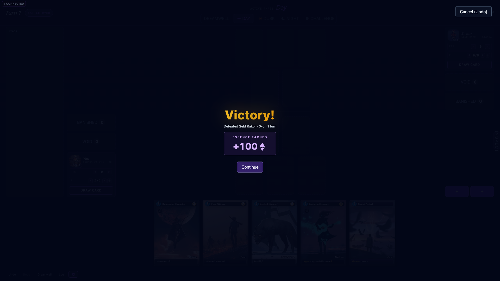

**What it does.** When the match ends, the board raises one of two end-of-battle
overlays depending on the outcome. A **win** raises the full **reward surface**
(the player's payoff for the fight); a **loss or draw** raises the smaller
**result overlay** (which offers a path back to the run). Both sit above all
other battle chrome, including the Inspector.

**Reward surface (Victory).** A topmost modal over a near-opaque dark scrim,
centered:

- a large gold **"Victory!"** title;
- a one-line **summary** beneath it pairing the defeated opponent with the final
  score and length (e.g. "Defeated Seraveth · 10-5 · 6 turns");
- an **"Essence Earned"** callout — a purple-tinted capsule with the reward value
  animating a **count-up** (e.g. "+100⬢"), glued to the essence glyph so it reads
  as currency;
- a primary **Continue** button that banks the reward and returns to the run
  (disabled while the reward is still locking in);
- a secondary **"Cancel (Undo)"** button in the top-right that appears only while
  the reward is still cancellable — backing out returns to the board so the
  result is round-trippable with Undo/Redo. Escape does the same while cancel is
  available.

**Result overlay (Defeat / Draw / inspected Victory).** A simpler centered panel
titled **"Victory."**, **"Defeat."**, or **"Draw."** with up to two actions: a
**"Keep inspecting"** button (always present) that dismisses the overlay so the
player can study the final board, and — on any non-victory result — a red
**"Reset run…"** button that abandons the run.

**Reopen pill.** Once either overlay has been dismissed (via "Keep inspecting" or
Cancel), a small **"<result> — reopen"** pill appears at the bottom of the board;
clicking it raises the corresponding overlay again so the player can return to
the reward/continue flow after inspecting.

**What you can click:** **Continue** / **Cancel (Undo)** on the reward surface;
**Keep inspecting** / **Reset run…** on the result overlay; the **reopen pill**
once an overlay is dismissed.

**Redesign notes.** The reward surface is a clean, celebratory full-screen
moment that maps well to mobile — title, summary, animated essence payoff, one
primary action. The two-overlay split (rich reward on a win, minimal result on a
loss) and the "inspect then reopen" affordance are the behaviors to preserve; the
Cancel/Undo round-trip is a developer-leaning nicety that a player-facing design
may want to drop in favor of a committed reward.

---

# Figment Creator (Developer)

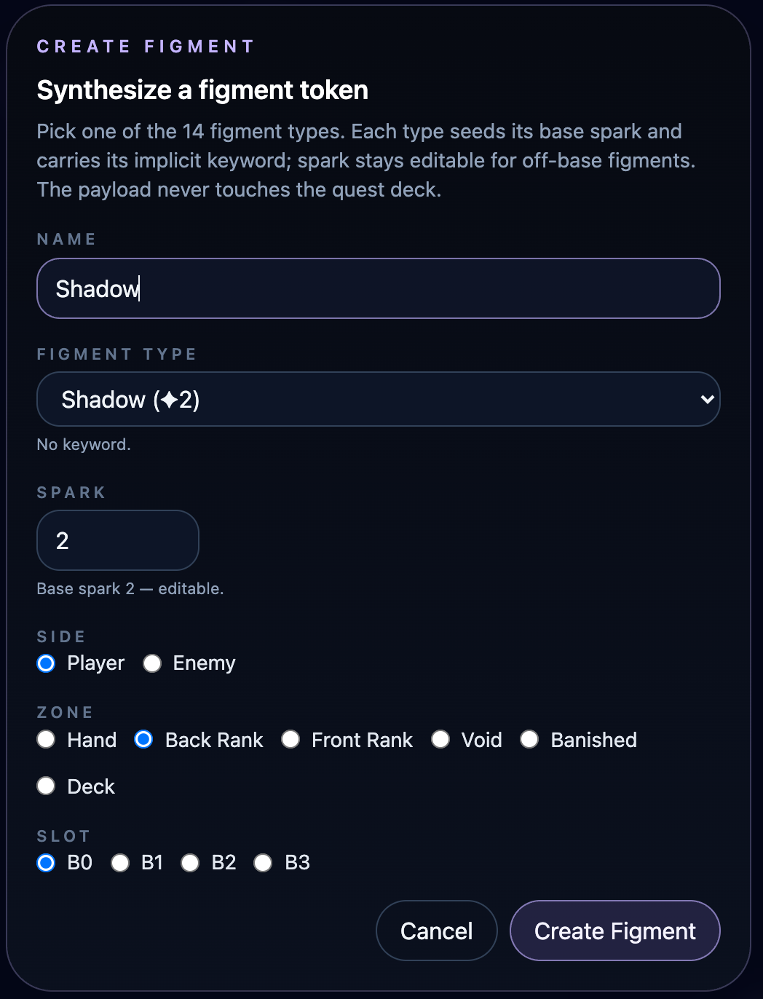

**What it does.** A **developer** overlay to synthesize a figment token directly
onto the board — for setting up board states and testing. Opened from the
Inspector's per-side "Create Figment". Not part of the player-facing game.

**Layout.** A modal headed "CREATE FIGMENT / Synthesize a figment token" with a
helper line, then fields: **Name**, **Figment Type** (a dropdown of the figment
types, each seeding a base spark and implicit keyword), **Spark** (editable),
**Side** (Player/Enemy), **Zone** (Hand / Back Rank / Front Rank / Void / Banished
/ Deck), and **Slot** (B0–B3), with **Cancel** / **Create Figment** actions.

**What you can click:** the type dropdown, the spark stepper, the side/zone/slot
radio options, and Cancel / Create Figment.

**Redesign notes.** Developer tooling — should live on a separate developer screen
on mobile, not in the battle UI.

---

# Card Note Editor (Developer)

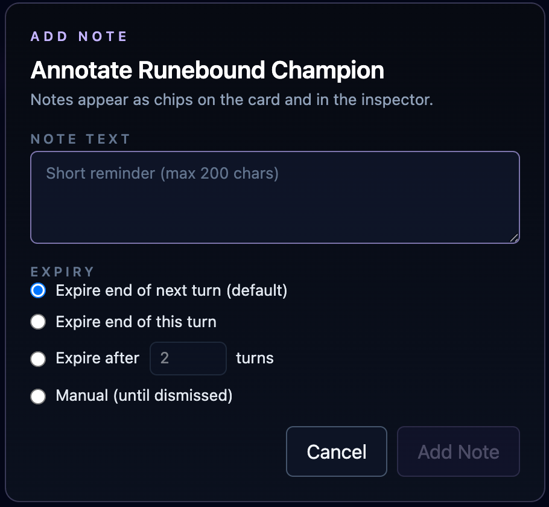

**What it does.** A **developer** overlay to attach a short note to a specific
card; notes render as chips on the card and in the Inspector. Opened from the card
context menu's "Add Note…" (see
[Card Context Menu](#card-context-menu-right-click)). Not part of the
player-facing game.

**Layout.** A modal headed "ADD NOTE / Annotate <card name>" with a **Note Text**
field (max 200 chars) and an **Expiry** choice (Expire end of next turn [default],
Expire end of this turn, Expire after N turns, or Manual until dismissed), plus
**Cancel** / **Add Note**.

**What you can click:** the text field, the expiry radio options (and the turns
spinner), and Cancel / Add Note.

**Redesign notes.** Developer tooling — belongs on a separate developer screen, not
the player-facing battle.

---

# Battle Inspector (Developer)

**What it does.** The Inspector is a **developer/debug panel** for the battle
board — a live read-out of battle state plus a dense set of tools for forcing
state, editing each side, and inspecting the AI. It is **not part of the
player-facing game**; it is promoted to its own section here because it is a
large, complex sub-UI. On desktop it is a right-edge drawer that is open by
default at wide widths; on a narrow layout it collapses to an "INSPECT" handle.
In a mobile redesign this belongs on a **separate developer screen**, not docked
beside the live board.

**How it opens.** A vertical **"INSPECT" / "CLOSE" handle** rides the right edge
of the board; clicking it toggles the drawer. The Action Bar's Inspector button
toggles the same drawer. When open it shows a header ("Inspector" + an ✕ close)
above a scrolling body of sections.

**Sections, top to bottom:**

- **Battle State** — a read-out: chips for the current **Turn**, **phase**,
  **active side**, and **result** ("Live" until decided); the **Battle**
  (opponent name); per-side **zone counts** in a compact code (H=hand, D=deck,
  V=void, B=banished, Bk=back rank, Fr=front rank); and the **Dreamwell order**
  band of the next Dreamwell card.
- **AI Reasoning** (only in AI battles) — the planner's read on the current
  decision: the held **Proposal** description, its **Kind**, the **Card** and
  **Target** involved, the **Heuristic** score before→after, a live static
  **board evaluation** ("Live eval", or "win"/"loss" when decided), the fixed
  **Planner** settings ("beam 12 · expectiminimax · sample 8"), and a count of
  **recent AI choices** with the latest rationale.
- **Visibility** — chip buttons: **Pool Viewer** (open the card-pool browser),
  **Show / Hide enemy hand**, and **Hide / Show player hand** (the
  multiplayer-view simulation).
- **Result** — chip buttons to force an outcome: **Skip to rewards**, **Force
  defeat**, **Force draw**, and a red **Reset battle**.
- **Your state** and **Enemy state** — one editor block per side, each with:
  stepper rows for **Energy**, **Max energy**, and **Score**; a **Draw / discard**
  row (**+1 Draw**, **Discard**); a **Deck tools** row (**Foresee**, **Shuffle**,
  **Open Deck**); a **Dreamwell + draw** button (run the energy ramp + draw); an
  **Erode** row (a count stepper + an "Erode N" button that mills the top N cards);
  and a **Side actions** row (**Create Figment**).
- **History** — **↶ Undo** and **↷ Redo** chips (disabled when there is nothing to
  undo/redo).

**What you can click:** every item above is a control — read-outs in Battle State
/ AI Reasoning are passive, and everything in Visibility, Result, the per-side
editors, and History is an actionable chip, stepper, or button. Several of these
open their own overlays (Pool Viewer, Foresee, the deck browser, the Figment
creator), which are themselves complex sub-UIs.

**Redesign notes.** This panel has no player-facing role and should be excluded
from the gameplay layout entirely, re-homed onto a dedicated developer screen.
Documented here so its tools are inventoried and so the board's redesign can
reclaim the ~27% of screen width it currently occupies.
