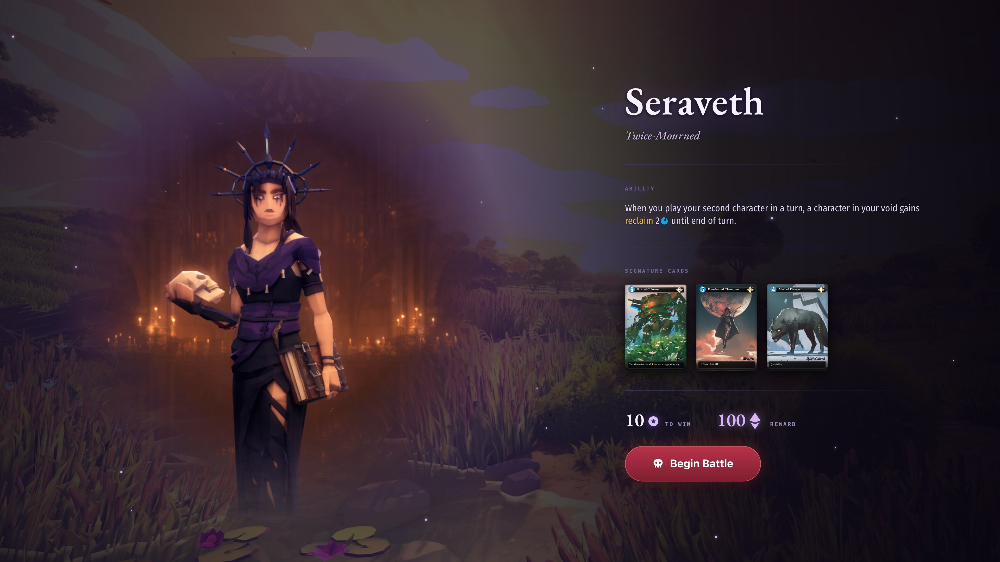
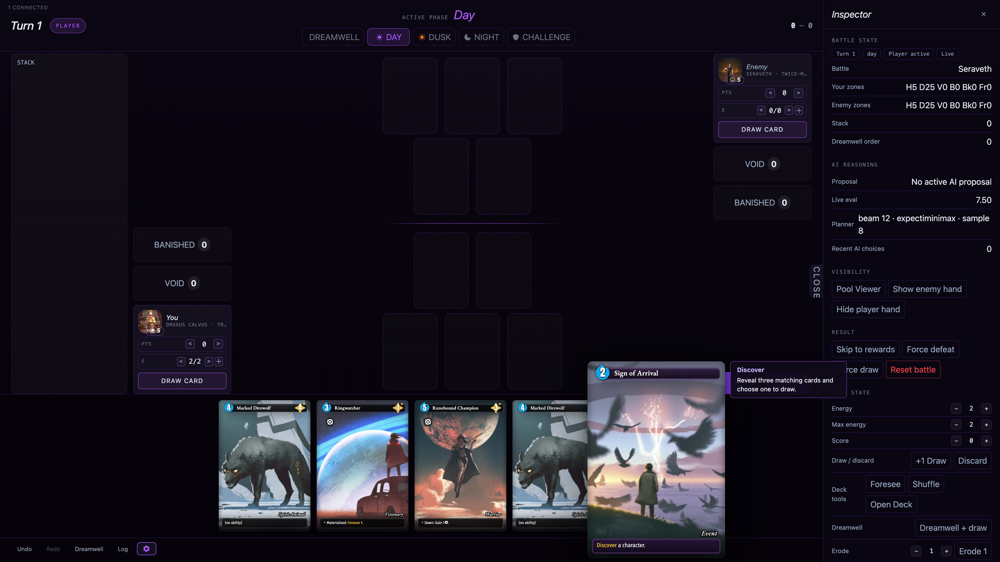
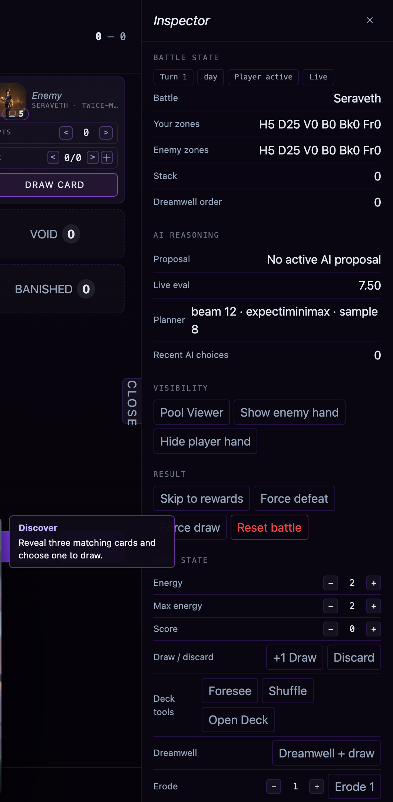

# Battle UI Visual Guide

This document is the battle-mode companion to the
[Quest Prototype Visual UI Guide](ui_visual_guide.md). Battle mode is by far the
most complex part of the prototype — a full card game with its own board, phases,
zones, overlays, and a developer Inspector — so it lives in its own document. The
quest/meta screens (Dreamcaller Selection, Dream Atlas, sites, deck viewer, etc.)
are documented in the main guide; everything that happens during or around a
match is documented here.

Conventions are the same as the main guide: each screen or complex sub-UI is its
own top-level (`#`) section; screenshots are captured at 1920×1080; the guiding
question for each is "what can you click or hover here, where is it, and what
does it do?". Developer/debug surfaces are documented but flagged as things that
should become their own separate screens in a mobile redesign rather than panels
crowded onto the live board.

A battle has two top-level screens — **Battle Start** (the pre-match intro) and
the **Battle Board** (the live match) — plus a family of overlays and panels the
board raises (card browsers, the Foresee overlay, card pickers, the right-click
context menu, side-summary hovers, and the developer Inspector), each documented
in its own section below.

---

# Battle Start (Pre-Battle Intro)

**What it does.** Shown when the player arrives at a Battle site, before the match
begins. Its job is to introduce the opposing Dreamcaller — its abilities,
signature cards, and any dreamsigns — and state the stakes (score to win, essence
reward) so the player can scout the fight before committing to it. Clicking
through starts the match.

**Layout.** A cinematic split composition rendered over the dreamscape's scene
art, dimmed for contrast:

- **Left:** the enemy Dreamcaller's **full-body figure**, lit with ambient
  particle/glow effects, occupying the left half (intended to be the animated 3D
  model in its "card" presentation).
- **Right:** a text column, top to bottom:
  - the enemy Dreamcaller's **name** (e.g. "Seraveth", large serif) and
    **title/subtitle** beneath it (e.g. "Twice-Mourned", italic);
  - an **"ABILITY"** label and the Dreamcaller's **rules text**, with keyword
    terms (e.g. "reclaim") highlighted inline;
  - a **"SIGNATURE CARDS"** label and a **row of 3 face-up card thumbnails**;
  - a stats line pairing the **score to win** for this battle (e.g. "10 to win")
    with the **essence reward** (e.g. "100 essence"), each with its glyph;
  - a primary **"Begin Battle"** button (purple, glowing) below the stats.
- If the opponent carries **dreamsigns** (from the run's midpoint onward), those
  are surfaced here as well so the player can see the opponent's passive effects.

In portrait the figure moves to the top and the text column flows beneath it.

**What you can click:**

- **Begin Battle** — starts the match. The camera transitions from this intro to
  the battle board: the enemy Dreamcaller animates to its battle position (small
  head-only card), both decks and the player's Dreamcaller animate to their
  starting spots, and opening hands are dealt to both sides. This is the single
  forward action on the screen.

**What you can hover / long-press:**

- **The ability text** → glossary term definitions, as on the Dreamcaller select
  screen and on cards.
- **Each signature card thumbnail** → an enlarged card preview with full art and
  rules text.
- **Any opponent dreamsign** (when present) → the full dreamsign card on hover.

**Redesign notes.** This screen is mostly presentational and translates to mobile
relatively cleanly (figure on top, scouting info + a single big "Begin Battle"
button below). The key content to preserve is the *scouting* function — ability,
signature cards, dreamsigns, and the win/reward stakes must all be legible before
the player commits, and the card/dreamsign detail currently locked behind hover
needs a tap equivalent.

---

# Battle Board (In-Battle)

**What it does.** The live card match, played under the rules in
[battle_rules.md](../../battle_rules/battle_rules.md). The board is **symmetric**:
the two sides mirror each other around a central battlefield, with the local
player anchored at the bottom and the opponent at the top. By default a local AI
drives the opponent and "Basic Automation" handles routine rules bookkeeping, so
the player mostly plays cards and advances phases. This is by far the most complex
and information-dense screen in the app.

> **Screenshot note:** the capture above has the developer **Inspector** open
> along the right edge, which compresses the board. The Inspector is a debug
> surface (detailed at the end of this section) and is **not part of the
> player-facing battle** — picture the board widened to fill the space it
> occupies.

**Top chrome — the Status Bar.** A bar across the very top carries the global
match state: the **turn / round number** ("Turn 1"), a **phase rail** naming the
turn's phases — **DREAMWELL · DAY · DUSK · NIGHT · CHALLENGE** — with the current
phase highlighted, and both sides' **scores** (points toward the win threshold).
The active phase advances through this sequence; in manual mode the phase names
act as controls to set the phase. A screen-reader live region (not visible)
announces "<side> Turn N <Phase>" as state changes.

**AI proposal banner.** Just under the status bar, a slim banner appears while the
AI opponent holds an un-approved move ("AI proposes: …") or is computing one
("AI · Thinking…"). While a proposal is held, the player's own board controls are
locked and the human acts only through the approve/reject icons in the phase
cluster (see below). The banner renders nothing on the human's own turn.

**Central battlefield (top → bottom).** The middle of the screen is the shared
battlefield, stacked as opposing ranks:

- **Enemy back rank**, then **enemy front rank** (the opponent's character slots);
- a **judgment divider** line across the middle that lights up ("active") during
  the **Challenge** phase, when opposing front ranks fight;
- **player front rank**, then **player back rank** (the local player's slots).

Each rank is a row of card slots; characters are played into slots and can be
repositioned. Above the battlefield, during the Dreamwell phase (turn 2+), the
current **Dreamwell card** for the active side is shown centered (the card that
ramps energy / draws for the turn).

**Side columns (flanking the battlefield).** To the left and right of the
battlefield sit two **side-zone columns**, one per side, each containing:

- a **Void** and a **Banished** small-zone button, each showing a count; clicking
  one opens that zone's full **card browser**, and cards can be dragged onto them;
- a **Status Strip** for that side showing the side's **Dreamcaller portrait**
  (name + title), **energy** (current/max — the resource for playing cards),
  **score**, and a **Draw Card** control, with the active side highlighted.
  Clicking the portrait opens that side's **summary popover** (Dreamcaller ability
  + dreamsigns). The strip also exposes per-side energy/score/draw steppers used
  for manual play and debugging.

There is also a **Stack zone** (labeled "Stack") used while a card/effect is
resolving, with per-entry "Void" / "Banish" resolution buttons, and it accepts
dropped cards.

**The player's hand.** A **hand tray** runs along the bottom: the local player's
cards fanned/rowed face-up, showing each card's cost and art. (A debug mode can
hide the player's hand and/or reveal the opponent's hand in a tray at top.)

**Bottom Action Bar.** Below the hand, a row of controls: **Undo / Redo**, a
**Basic Automation** on/off gear toggle, a **Battle Log** toggle (opens a
side drawer of the full command history), a **Dreamwell History** toggle (the
drawer of revealed Dreamwell cards), and the **Inspector** toggle.

**What you can click / interact with (player actions):**

- **Cards in hand** — double-click (or drag) plays a card to the battlefield,
  paying its energy cost (automation routes events to the void and spends energy);
  right-click opens a context menu of card actions; hover shows an enlarged
  preview.
- **Battlefield characters** — drag to reposition/swap slots; drag cross-side or
  to a zone to move; right-click for the context menu; hover for the enlarged
  card preview.
- **Phase controls / phase rail** — advance the turn. Much routine work
  (spending energy, ramping/drawing at start of turn, clearing exhaustion at
  Dawn, resolving the Challenge, enforcing the hand limit, advancing bookend
  phases) is handled automatically by Basic Automation; with it off, every step
  is manual.
- **The AI approve / reject icons** (in the phase cluster) — when the AI holds a
  proposal, a check **approves** it (committing it to shared state) and a cross
  **rejects** a proposed card play.
- **Void / Banished / Stack zones** — click to open a zone's card browser; drop
  cards onto them to move cards there.
- **Side Status Strip portrait** — opens the side's Dreamcaller/dreamsign summary.
- **Action Bar buttons** — Undo, Redo, toggle Automation, Battle Log, Dreamwell
  History, Inspector.

**Overlays this screen can raise** (each a modal/drawer over the board): the
**zone browser** (full contents of a void/banished/deck zone), a **card picker**
and a **choice prompt** (for effects that ask the player to pick cards or choose
an option), a **Foresee** overlay (look at / reorder the top of a deck), a
**deck-order picker**, the **side summary** popover, the **Dreamcaller panel**,
the **Battle Log** and **Dreamwell History** drawers, and finally the
**result/reward overlay** when the battle ends (Victory shows the reward surface;
Defeat shows the result overlay with a reset path — see the Victory/Defeat
screen).

> **Developer surfaces on this screen** (each should be its own separate screen
> on mobile, not an inline panel): the **Battle Inspector** (right-edge drawer —
> documented in its own section below), the **right-click card context menu**
> (per-card debug actions and card notes), and the board's manual
> energy/score/phase steppers built into the status strips for hand-driven/debug
> play. The intended player-facing battle is the status bar + phase rail, the
> symmetric battlefield, the side status strips (score/energy), the hand tray, and
> the minimal action bar — everything else is developer tooling.

**Redesign notes.** This is the hardest screen to fit to portrait: it must
simultaneously present two mirrored multi-rank boards, two side columns of
resources and zones, a phase timeline, a stack, the hand, and an action bar.
The developer Inspector currently consumes roughly a third of the width and
should be removed from gameplay-layout consideration entirely (re-homed to a
separate debug screen). The persistent "chrome" a mobile layout must keep
glanceable is small but essential: whose turn / which phase, both scores, and the
active side's energy and hand. The biggest spatial tension is that a symmetric
top-vs-bottom board plus a bottom hand and bottom action bar all compete for
vertical space on a phone; the side columns (zones + status strips) have no
natural home in a narrow layout and will likely need to collapse into
tap-to-open chips.

---

# Battle Inspector (Developer)

**What it does.** The Inspector is a **developer/debug panel** for the battle
board — a live read-out of battle state plus a dense set of tools for forcing
state, editing each side, and inspecting the AI. It is **not part of the
player-facing game**; it is promoted to its own section here because it is a
large, complex sub-UI. On desktop it is a right-edge drawer that is open by
default at wide widths; on a narrow layout it collapses to an "INSPECT" handle.
In a mobile redesign this belongs on a **separate developer screen**, not docked
beside the live board.

**How it opens.** A vertical **"INSPECT" / "CLOSE" handle** rides the right edge
of the board; clicking it toggles the drawer. The Action Bar's Inspector button
toggles the same drawer. When open it shows a header ("Inspector" + an ✕ close)
above a scrolling body of sections.

**Sections, top to bottom:**

- **Battle State** — a read-out: chips for the current **Turn**, **phase**,
  **active side**, and **result** ("Live" until decided); the **Battle**
  (opponent name); per-side **zone counts** in a compact code (H=hand, D=deck,
  V=void, B=banished, Bk=back rank, Fr=front rank); the **Stack** size; and the
  **Dreamwell order** band of the next Dreamwell card.
- **AI Reasoning** (only in AI battles) — the planner's read on the current
  decision: the held **Proposal** description, its **Kind**, the **Card** and
  **Target** involved, the **Heuristic** score before→after, a live static
  **board evaluation** ("Live eval", or "win"/"loss" when decided), the fixed
  **Planner** settings ("beam 12 · expectiminimax · sample 8"), and a count of
  **recent AI choices** with the latest rationale.
- **Visibility** — chip buttons: **Pool Viewer** (open the card-pool browser),
  **Show / Hide enemy hand**, and **Hide / Show player hand** (the
  multiplayer-view simulation).
- **Result** — chip buttons to force an outcome: **Skip to rewards**, **Force
  defeat**, **Force draw**, and a red **Reset battle**.
- **Your state** and **Enemy state** — one editor block per side, each with:
  stepper rows for **Energy**, **Max energy**, and **Score**; a **Draw / discard**
  row (**+1 Draw**, **Discard**); a **Deck tools** row (**Foresee**, **Shuffle**,
  **Open Deck**); a **Dreamwell + draw** button (run the energy ramp + draw); an
  **Erode** row (a count stepper + an "Erode N" button that mills the top N cards);
  and a **Side actions** row (**Create Figment**).
- **History** — **↶ Undo** and **↷ Redo** chips (disabled when there is nothing to
  undo/redo).

**What you can click:** every item above is a control — read-outs in Battle State
/ AI Reasoning are passive, and everything in Visibility, Result, the per-side
editors, and History is an actionable chip, stepper, or button. Several of these
open their own overlays (Pool Viewer, Foresee, the deck browser, the Figment
creator), which are themselves complex sub-UIs.

**Redesign notes.** This panel has no player-facing role and should be excluded
from the gameplay layout entirely, re-homed onto a dedicated developer screen.
Documented here so its tools are inventoried and so the board's redesign can
reclaim the ~27% of screen width it currently occupies.
