# Quest Prototype: Visual UI Guide

This document is a screen-by-screen visual reference for the current quest
prototype, written to brief a designer (e.g. Claude Design) on a mobile UI
redesign. It assumes the reader has read [quests.md](../../quests/quests.md),
which covers *what* each system does; this document covers *how each screen
presents and behaves today* — what is on screen, how it is laid out, and what
every clickable or hoverable element does. The guiding question for each screen
is: "what are all the things you can click or hover here, where are they, and
what do they do?"

Each screen below is its own top-level (`#`) section. Screenshots are captured at
1920×1080 (the prototype's design canvas) in a desktop/landscape layout. Most
screens also have a portrait layout for mobile; where the portrait arrangement
differs meaningfully it is called out in the text.

**Battle mode is documented separately.** Battle mode (the card-game match and
everything around it) is large and complex enough to have its own companion
document: the [Battle UI Visual Guide](battle_ui_visual_guide.md). This document
covers the quest/meta layer — Dreamcaller selection, the Dream Atlas, the
dreamscapes and their sites, the deck and pool viewers, and the end-of-run
screens.

**On developer/debug surfaces.** The prototype carries a layer of
developer/debug affordances mixed into the player UI: the "Create Game" / "Load
Quest" room gate, the "Debug: Regenerate Atlas" button, and the "⋯" utility
menu's developer entries (Pool Viewer, Package Debug, Why Cards, Why Journey,
Edit Quest State, Save/Load/Download Log). These are documented here rather than
hidden, but they are **not part of the player-facing game**. In a mobile redesign
they should become their own separate, dedicated screens (a developer/debug
screen reachable from a menu), not panels and overlays crowded into the live
gameplay screens. They are flagged inline wherever they appear.

---

# Dreamcaller Selection (Quest Start)

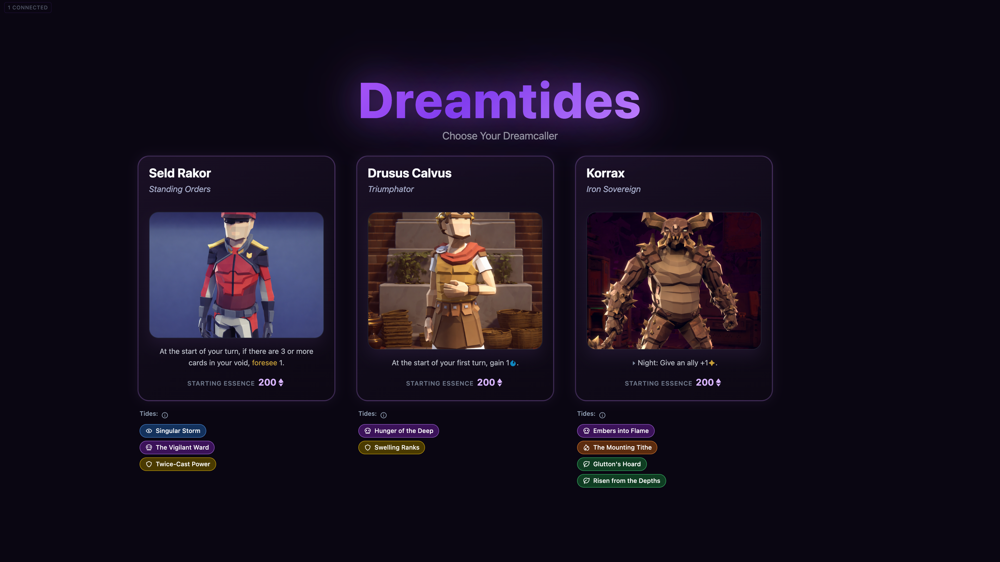

**What it does.** This is the first screen of a run. The player picks 1 of 3
offered Dreamcallers; the pick performs all run bootstrap (adds the fixed starter
deck, grants starting essence, builds the draft and dreamsign pools from the
Dreamcaller's tides, generates the initial atlas) and drops the player into
Firstlight Meadow. It is the only place the Dreamcaller is chosen, and the choice
defines the entire run, so the screen's job is to let the player compare three
distinct play identities at a glance and commit.

> **Developer surface (separate mobile screen):** in the prototype this screen is
> preceded by a "room gate" landing page — a centered "Dreamtides / Quest
> Multiplayer" splash with a glowing **Create Game** button and a **Load Quest ▾**
> dropdown in the top-right. Once a room is joined, a small **"N connected"**
> pill appears in the top-left showing the number of connected clients in the
> shared room. That gate is multiplayer/debug plumbing for creating or rejoining
> a shared room. For a player-facing design it should be replaced by a normal
> title/menu screen (or skipped entirely); the saved-run loading belongs on a
> dedicated developer screen.

**Overall layout.** Centered, vertically-stacked composition on a near-black
backdrop with a faint purple vignette:

1. A large gradient **"Dreamtides"** wordmark (purple, glowing) at top center.
2. A **"Choose Your Dreamcaller"** subtitle beneath it.
3. A single horizontal **row of three Dreamcaller cards**, equal width, centered.
   On load the title drops in from above, the subtitle fades in, and the three
   cards rise into place with a slight stagger. On mobile/portrait the three
   cards stack vertically instead of sitting in a row.

**Anatomy of a single Dreamcaller card** (top to bottom — every card is
identical in structure):

- **Header:** the Dreamcaller's **name** (e.g. "Seld Rakor") in bold, with its
  **title/epithet** (e.g. "Standing Orders") in italic beneath it.
- **Portrait panel:** a tall, rounded, framed image of the Dreamcaller filling
  most of the card. This is intended to be a live 3D character model performing an
  idle animation; in the current build it renders as a framed portrait.
- **Ability (rules text):** the Dreamcaller's ongoing/triggered ability, rendered
  with the app's shared rules-text styling — keyword terms (e.g. "reclaim") are
  visually highlighted inline exactly as they appear on cards.
- **Starting Essence:** a small labelled line ("STARTING ESSENCE") with the value
  (e.g. "200") shown using the essence glyph/styling used everywhere essence
  appears.
- **Draft direction:** below the card body, a **"Tides:" row** — a small label
  with an info icon, then a vertical list of **colored, icon-tagged tide pills**
  naming the card pools this Dreamcaller will draft from (up to 4 shown, largest
  first). This is how the player reads what kind of deck this Dreamcaller steers
  toward. (For non-tides draft algorithms this is replaced by a **"Signature
  Cards:"** list — a star-bulleted vertical list of named signature cards. Only
  one of the two appears.)

**What you can click:**

- **The whole Dreamcaller card is a single large button.** There is no separate
  "Select" control — clicking anywhere on the card selects that Dreamcaller and
  immediately starts the run. On hover the card lifts a few pixels and its border
  and outer glow brighten to signal it is the active target; on press it scales
  down slightly. This makes the entire card a generous hit target, which is
  good for touch, but it also means there is no distinct confirm step — a single
  tap commits the entire run, which a mobile design may want to gate behind an
  explicit confirm.

**What you can hover / long-press (these reveal information that exists *only* on
hover today — important to re-home for touch):**

- **The ability text block** → a popover that defines any glossary terms used in
  the ability (the same term-definition panel shown beside cards elsewhere). So
  the full meaning of the ability is only available on hover.
- **The "Tides:" / "Signature Cards:" label's ⓘ info icon** → a tooltip
  explaining the concept ("Pools of cards you will see during the quest.
  Different tides are used every time you play." / "These signature cards define
  this Dreamcaller's strategy and steer the draft pool toward them.").
- **Each individual tide pill** → a tooltip describing that specific tide's theme
  and contents (its summary/description).

**Redesign notes.** The information hierarchy per Dreamcaller is: identity (name
+ portrait + epithet) → power (ability text) → economy (starting essence) →
draft direction (tides). Three of these cards need to be compared side-by-side,
which the portrait-heavy layout makes hard on a narrow screen: vertical stacking
forces scrolling and loses the at-a-glance comparison. A large amount of
secondary, decision-relevant detail (each tide's meaning, glossary terms) lives
exclusively in hover popovers, which have no touch equivalent. And because the
whole card is a single button with no confirm step, one tap commits the entire
run.

---

# Dream Atlas

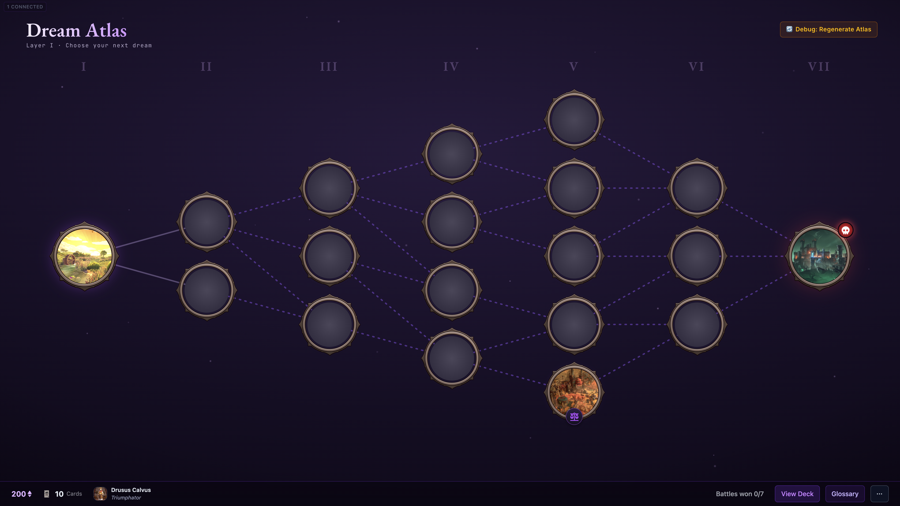

**What it does.** The Dream Atlas is the between-dreamscapes world map and the
hub the player returns to after every battle. It renders the entire run as a
7-layer branching graph from Firstlight Meadow (left) to the final boss in Limbo
(right), shows how far the player has progressed, and is where the player chooses
which dreamscape to enter next. The player threads exactly one node per layer
toward the boss; the map is never pruned, so the chosen and forgone routes both
stay visible.

**Stage and framing.** The whole map is a fixed 1920×1080 "stage" that uniformly
scales to fit the viewport and is letterboxed (it never reflows — it just shrinks
to fit, which on a tall phone leaves large empty bands). The background is a dark
purple "dream" wash with ~26 slowly drifting glowing "mote" particles for
atmosphere. Fixed overlays sit on top of the scaling stage:

- **Top-left title block:** a "Dream Atlas" heading and a subtitle reading
  "Layer <N> · Choose your next dream" (or "Seven layers to the final dream" when
  nothing is selectable).
- **Layer numerals I–VII** are drawn as large faint watermarks across the top,
  one centered over each column, so the player can read which layer is which.
- **The node graph** fills the center (see below).
- **Persistent bottom HUD** (rendered app-wide; see the HUD section) runs along
  the bottom edge with essence, deck size, Dreamcaller portrait, dreamsigns,
  "Battles won N/7", and the View Deck / Glossary / utility buttons.
- **Top-right "🔄 Debug: Regenerate Atlas" button.** *Developer surface —
  on mobile this belongs on the separate developer screen, not on the map.* It
  discards and rebuilds the atlas at the current progress depth for live
  iteration on map generation.

**The node graph.** Circular nodes are arranged in 7 vertical columns (one per
layer), connected by glowing lines (edges). Firstlight Meadow is the single
larger node on the far left; the red boss node (Limbo) is the larger node on the
far right and is **always revealed** from the start so the destination is visible.
Node and edge appearance encode the run's state and are the screen's core visual
language:

**Node states** (each visually distinct, and this distinction is the whole point
of the screen):
- **Unrevealed** — an empty gray round frame (dreamscape not yet known).
- **Revealed-locked** — shows its dreamscape's circular scene icon, but sits in a
  future layer that can't be chosen yet.
- **Available** — reachable from the just-completed node; selectable now. Its
  incoming edge is drawn as a bright, animated "open" flow line.
- **Completed** — a dreamscape already visited and won.
- **Forgone** — was revealed/reachable but the player took a different route;
  rendered dimmed, can never be visited.

**Node faces:**
- The **starter** shows a meadow/flag icon with subtle "you started here"
  emphasis.
- The **boss** shows a skull/boss icon in a red frame.
- A **revealed dreamscape** shows its circular scene icon plus a small
  **signature-site badge icon** in the corner — the enhanced site that dreamscape
  is guaranteed to offer (this, plus the name, is how the player reads what a
  dreamscape specializes in before entering).
- A node carrying a **known dreamsign** additionally shows that dreamsign's icon
  in its corner.

**Edge styles:** edges originating at or before the current choice layer are
drawn **solid** (routes the player can already reason about); edges reaching
forward into still-locked layers are **dotted** (speculative). Completed→completed
edges read as "traveled"; completed→available edges get the animated "open" flow.
Edges never cross.

**What you can click:**

- **An "available" node** — clicking it sets that dreamscape as the current
  destination and navigates to its Dreamscape screen. Only `available` nodes are
  clickable; nodes in every other state are inert.
- *(Developer)* the "Debug: Regenerate Atlas" button.

**What you can hover / long-press — the heart of this screen's information.**
Hovering a node pops a large **floating preview card** that auto-flips to whichever
side of the node has room and is vertically clamped to stay on stage.

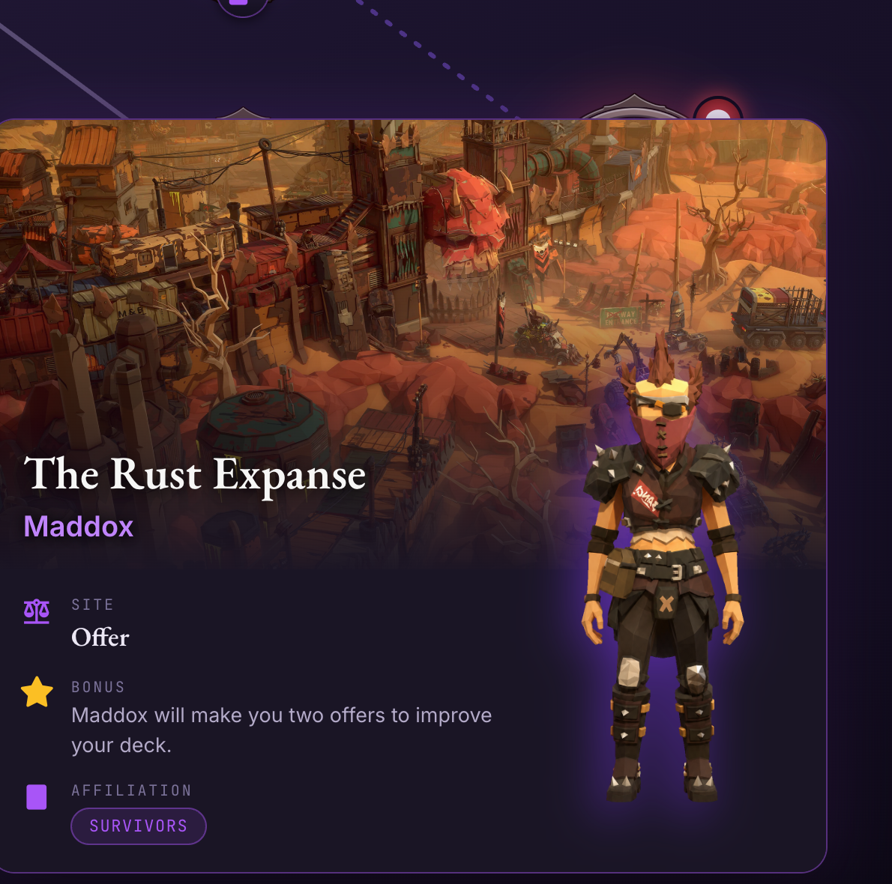

The dreamscape preview card (above, for "The Rust Expanse") is the richest of
these: a scene-art banner with the dreamscape **name**, the resident **Dream
Guide** (here "Maddox", shown as a name and a portrait figure), and three labeled
info rows — **Site** (the signature site, "Offer"), **Bonus** (the guide's
home-specialty text, "Maddox will make you two offers to improve your deck"), and
**Affiliation** (a named pill, "Survivors"). This card is the only place the
player can read what a dreamscape actually offers before committing to it. There
are three preview variants plus an optional companion card:

- **Revealed dreamscape → full preview** (≈560px wide): the dreamscape's **scene
  art** banner with its **name**; the resident **Dream Guide**'s name and
  portrait figure; and three info rows — **Site** (the signature site name +
  icon), **Bonus** (the guide's home-specialty text), and **Affiliation** (a
  named pill, or "None — a neutral on-ramp"). This is where the player learns
  what a dreamscape actually offers.
- **Boss node → red "Final Battle" preview**: Limbo's scene art, the boss figure,
  and rows naming **Apollyon** and describing the run's specific **incarnation**
  (its title and short deck description), so the player can scout the final fight.
- **Unrevealed node → compact "An Unseen Dream" card**: a short placeholder
  explaining the node is revealed only as the player draws near.
- **Firstlight Meadow → a short "a quiet place where every dream quest begins"
  note** (no guide/affiliation rows).
- **Known-dreamsign companion card** (≈308px): when a hovered node carries a known
  dreamsign, a second card appears beside the preview showing the dreamsign's art,
  name, and full rules text.

**Redesign notes.** This is the most information-dense navigation screen, and
nearly all of its decision-relevant content (what each dreamscape offers: guide,
site, bonus, affiliation, any known dreamsign) lives only in hover previews that
are far too large (up to ~560 + ~308 px wide) to sit beside a node on a phone,
and have no touch equivalent. The 7-column horizontal graph is inherently wide
and is the single biggest portrait-orientation challenge in the app:
letterbox-scaling it to a tall screen makes the nodes tiny. The five node states
and four edge styles are a rich visual vocabulary that has to stay
distinguishable at small sizes.

---

# Persistent HUD (Bottom Bar)

The HUD is the one piece of chrome that is **always on screen** during the
quest/meta layer — it runs along the bottom edge of the Dreamcaller-selection,
Atlas, Dreamscape, every site, and the end-of-run screens (it does not appear in
the live battle board, which has its own status strips). It is a frosted, blurred
bar that carries the run's persistent state and the global utility controls, so
it is visible in almost every screenshot in this guide. It is documented once
here and referred to elsewhere as "the HUD".

**Layout.** A three-zone bar (it collapses to two stacked zones on the narrowest
widths): a **left status cluster**, a **center counter**, and a **right control
cluster**.

**Left status cluster** (the run's resources, left to right):

- **Essence total** — the essence glyph plus the current balance; it animates a
  count-up whenever essence changes (a purchase, an essence site, a reward).
- **Deck size** — a card glyph plus the number of cards currently in the quest
  deck.
- **Dreamcaller chip** — a small circular portrait with the Dreamcaller's name and
  title beside it (the text is hidden on the narrowest widths). **Hovering it
  raises the Dreamcaller popover** (see below).
- **Dreamsign row** — a row of small art thumbnails, one per dreamsign the player
  currently holds (up to the 12 cap). **Hovering a thumbnail raises that
  dreamsign's hover card** (its larger art, name, and full effect text). Only the
  first several thumbnails are drawn inline; once the player holds more than fit,
  a trailing **"+N" overflow pill** caps the row. **Hovering the pill** raises a
  scrolling popover listing every overflowed dreamsign (each with its name and
  full effect text).

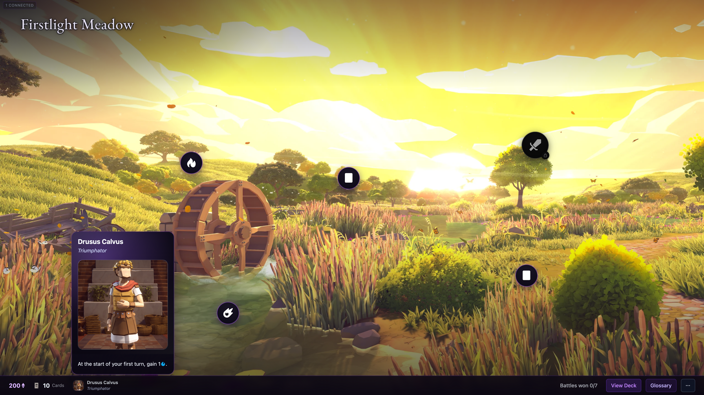

The **Dreamcaller popover** (above) floats up from the chip and shows the
Dreamcaller's portrait, name, title, and full ability text — the only place on
the meta screens to read the active Dreamcaller's ability without opening the
deck viewer.

**Center counter.** A "Battles won N/7" readout (hidden on the smallest widths)
showing run progress toward the seven-battle win.

**Right control cluster** (the global actions):

- **View Deck** — opens the full-screen [Deck Viewer](#deck-viewer).
- **Glossary** — opens the [Glossary](#glossary) modal.
- **"⋯" utility menu** — opens the [developer utility menu](#developer-surfaces)
  (Pool Viewer, Package Debug, Edit Quest State, Save / Load Quest, Download Log).

**What you can click:** View Deck, Glossary, the ⋯ menu, and the Dreamcaller chip
(on wide layouts the chip is itself interactive). **What you can hover:** the
Dreamcaller chip (→ popover) and each dreamsign thumbnail (→ hover card).

**Redesign notes.** The HUD packs five distinct kinds of run state (essence,
deck count, Dreamcaller, dreamsigns, progress) plus three global controls into one
bar; on a phone these compete for a single narrow row. Essence and deck size are
the state that has to stay glanceable, while the Dreamcaller ability and
dreamsign effects are reachable only on hover, with no touch equivalent. The "⋯"
menu mixes developer tooling into the player-facing HUD.

---

# Dreamscape Screen

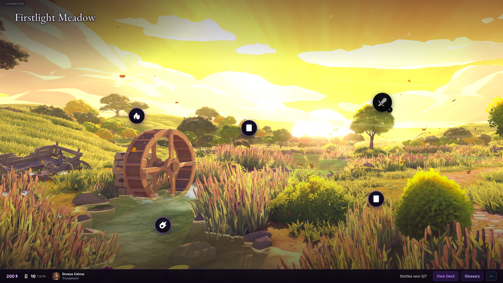

**What it does.** The Dreamscape screen is the inside-a-dreamscape view the player
lands on after choosing a node on the Atlas. It presents the dreamscape's
collection of [sites](../../quests/quests.md#dreamscape-sites) as a scatter of
clickable nodes over the dreamscape's scene art, and is the hub the player works
through — visiting each site once, in any order — before the dreamscape's final
Battle becomes available. Completing the Battle returns the player to the Atlas to
choose the next dreamscape.

**Layout.** A full-bleed, dimmed **scene-art backdrop** unique to the dreamscape
(it cross-fades when the dreamscape changes), with the **dreamscape name** in the
top-left and drifting atmospheric "mote" particles for ambiance. The HUD runs
along the bottom. Scattered across the scene are the **site nodes**: small
circular discs, each a single site, placed in a stable, seeded scatter (the same
dreamscape always lays its nodes out the same way). Each node carries a glyph for
its site type and is **color-coded** — battles use an accent color (red for a
normal Battle, gold for the final boss), and a locked node is greyed with a
padlock.

**Node behavior:**

- A visited site **disappears** from the scene once completed (the remaining
  layout stays put), so the screen visibly empties as the player works through the
  dreamscape.
- The **Battle node is locked** (grey + padlock) until every other non-battle site
  has been visited; it then unlocks as the last stop. The final dreamscape shows it
  as "Final Boss".
- **Draft nodes** show their pick count (e.g. "Draft 5x").

**What you can click:**

- **Any unlocked, unvisited site node** — navigates into that site's screen. Locked
  (the gated Battle) and already-visited nodes are inert.

**What you can hover / long-press:**

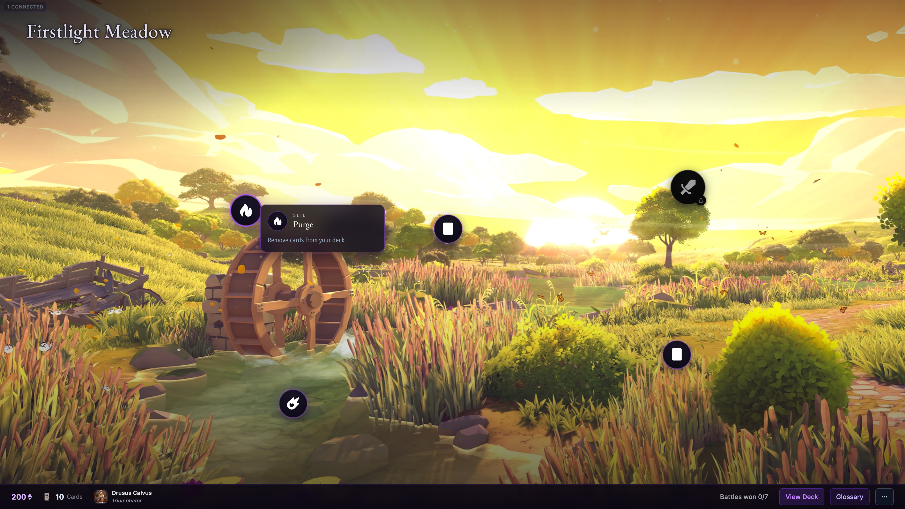

- **Any site node** → a small frosted **popover** (above) anchored to the node,
  giving the site's **name** and a one-line description of what it does (here
  "Purge — Remove cards from your deck"). This is the only label a node carries
  until hovered, so the popover is how the player tells the sites apart before
  committing.

**Redesign notes.** The scatter-of-nodes-over-art layout is evocative but leans
hard on hover: a node communicates almost nothing until hovered, and on a phone
the discs would be small, close-packed tap targets with no room for an adjacent
popover. The site names and one-line descriptions are available only on hover,
with no touch equivalent. The "Battle is locked until everything else is done"
rule and the "visited sites vanish" feedback are the two pieces of state the
layout has to keep legible.

---

# Site Screens

The sections below cover the individual **site screens** the player enters from a
Dreamscape. They share a common frame: the dreamscape's dimmed scene art as a
backdrop, the persistent HUD along the bottom, and — for sites with a resident
[Dream Guide](../../quests/quests.md#dreamscapes-and-dream-guides) — the guide's
figure in the lower-left with a **speech bubble** of flavor dialog (in landscape;
the guide moves above the content in portrait). Almost every site has a **red "✕"
close button** in the top-right that completes/leaves the site and returns to the
Dreamscape; the exceptions are noted per site. The **Battle** site is documented
in the companion [Battle UI Visual Guide](battle_ui_visual_guide.md).

**Regular vs. enhanced.** When a site appears in its guide's **home dreamscape**
it is *enhanced* (the guide's [Home
Specialty](../../quests/quests.md#home-specialties)), and the screen renders
differently from the standard, non-home version. Each guide site below shows both
its regular and its enhanced capture and calls out the visible difference. The
guideless sites — **Battle**, **Draft**, **Essence**, and **Dreamsign Reward** —
are never enhanced and have only one form.

## Draft

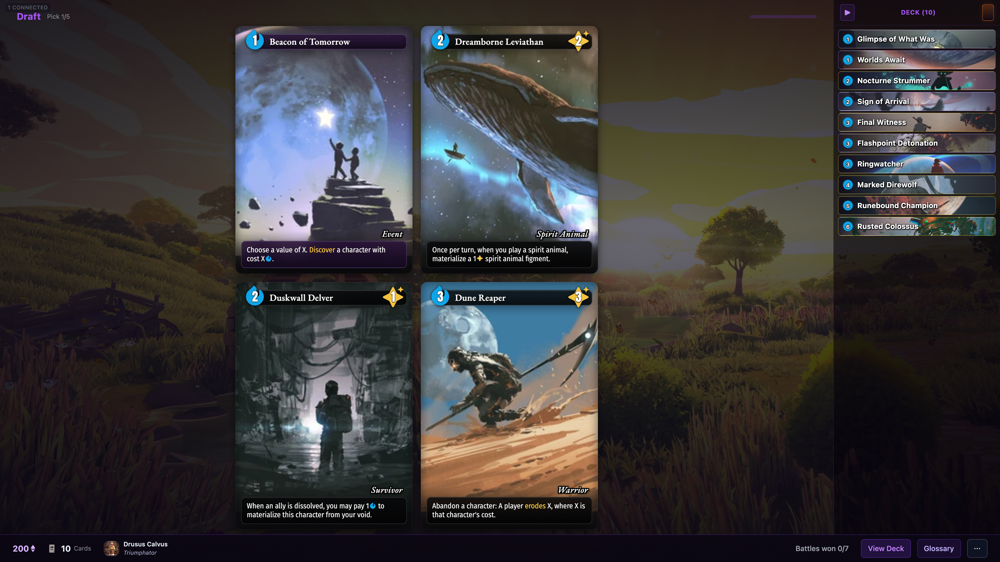

**What it does.** The Draft site adds cards to the deck through the run's draft
pool. Each Draft site is **5 picks**; each pick offers **4 unique cards**, and
choosing one adds it to the deck and brings up the next pick.

**Layout.** The four offered cards are shown large and face-up in the center
(here a 2×2 grid of full card renders, sorted by cost), with a **"Draft — Pick
N/5"** label in the top-left and a **progress bar** beside it that fills as picks
are made. A **deck tray** down the right edge lists the cards acquired so far this
visit; cards drafted more than once show a **"×N" copy-count badge** on their row,
and the row that just received a pick **flashes/glows** to show where the new card
landed. A **chevron toggle** docked at the tray's inner edge **collapses the tray
to a thin rail** (and re-expands it), reclaiming space for the offer. There is no
resident guide on the Draft site (it has no Dream Guide); the red "✕" in the
top-right cancels out of the site.

**What you can click:**

- **An offer card** — picks it. The chosen card flies to the deck tray, the tray
  highlights, and the next pick's four cards animate in. After the 5th pick a
  **summary** of all five drafted cards is shown with a **Continue** button that
  returns to the Dreamscape.
- **Close (✕)** — leaves the Draft site.

**What you can hover:** **each offer card** → an enlarged card preview (full art +
rules text) after a brief delay.

**Redesign notes.** This is a repetitive decision (pick 1 of 4, ×5) carrying four
cards plus a running deck tray. The card detail is hover-only, with no touch
equivalent. The per-pick progress ("N/5") and the end-of-site summary are what
tell the player how many picks remain.

## Card Shop

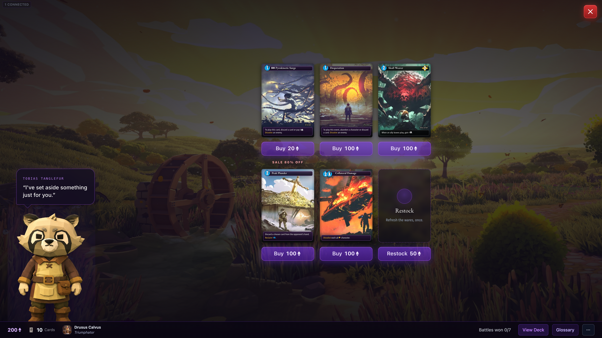

**What it does.** The Card Shop (guide: **Tobias Tanglefur**) is the primary place
to spend essence on cards. It shows a fixed set of purchasable cards plus a
single **restock** option that refreshes the unsold wares once, also for essence.

**Layout.** Tobias stands lower-left with a speech bubble. The wares sit in the
center as a row of **card offers**, each with a purple **"Buy N⬢"** price button
beneath it; cards on sale show a **"SALE X% OFF"** tag and a struck/disc price. A
**restock tile** sits at the end of the row showing its essence cost. The top-left
shows the running essence balance (and discount, when one applies). The red "✕"
("Leave Shop") in the top-right ends the visit.

**What you can click:**

- **A card's Buy button** — purchases it (if affordable); the card lifts and fades,
  essence is deducted (the HUD essence count-up plays), and the slot settles into a
  ghosted **"Acquired"** state. Cards the player cannot currently afford show a
  disabled Buy button.
- **The restock tile** — refreshes the unsold wares once for essence; the wares
  scale out and the new set scales in. Once used, the tile relabels to
  **"Restocked"** and disables.
- **Close (✕)** — leaves the shop. Purchased/unpurchased wares stay visible but the
  site cannot be re-entered.

**What you can hover:** **each ware card** → an enlarged card preview.

**Enhanced (Tumbleleaf Village, Tobias's home).**

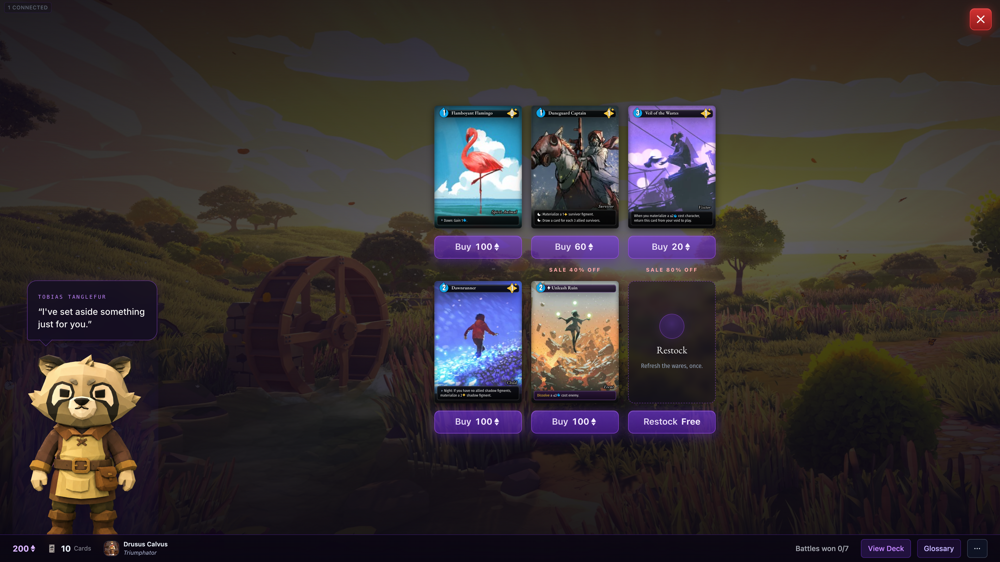

In Tobias's home dreamscape the shop is enhanced: the **restock tile reads
"Restock Free"** instead of charging essence, and the wares are drawn from the
player's Dreamcaller signature tide (so the offered cards differ, often more
strongly on-theme). The layout is otherwise identical to the regular shop.

**Redesign notes.** The screen carries several pieces of state at once: the
price/sale tags, the affordability of each card (whether the player can afford
it), and the once-only restock (which is free in the enhanced form). Card detail
is hover-only, with no touch equivalent.

## Dreamsign Market

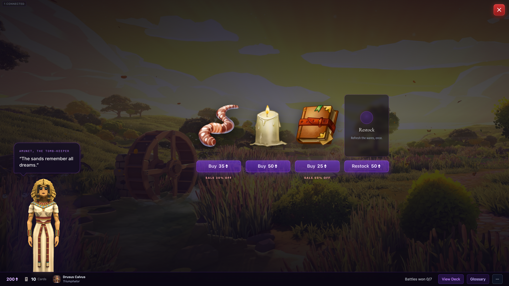

**What it does.** The Dreamsign Market (guide: **Amunet, the Tomb-Keeper**) is the
Card Shop's sibling for **dreamsigns**: it sells dreamsigns for essence with the
same restock option. It uses the same shop screen, so the layout and interactions
are identical to the Card Shop; only the wares differ — each offer is a
**dreamsign art tile** (with a bane badge when applicable) rather than a card, with
the same purple **"Buy N⬢"** price button and sale tags.

**What you can click / hover:** the same as the Card Shop — **Buy** a dreamsign,
**restock**, **close**; hover a tile for its detail. A purchased dreamsign animates
into the HUD dreamsign row.

**Enhanced (Pharaoh's Gate, Amunet's home).**

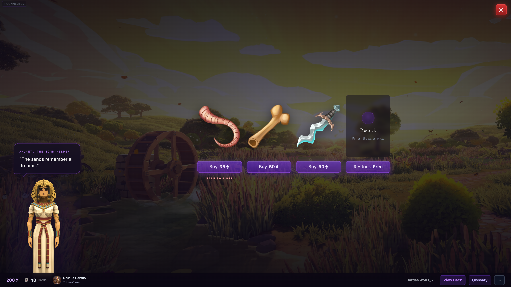

In Amunet's home dreamscape the **restock tile reads "Restock Free"** (the player
may refresh the dreamsign choices once at no cost); the layout is otherwise the
same as the regular market.

**Redesign notes.** Same as the Card Shop. The one extra wrinkle is the
dreamsign cap (12): a market purchase that would exceed it routes through the
dreamsign-purge overlay (see
[Edge-Case Overlays](#edge-case-overlays)).

## Dreamsign Revelation

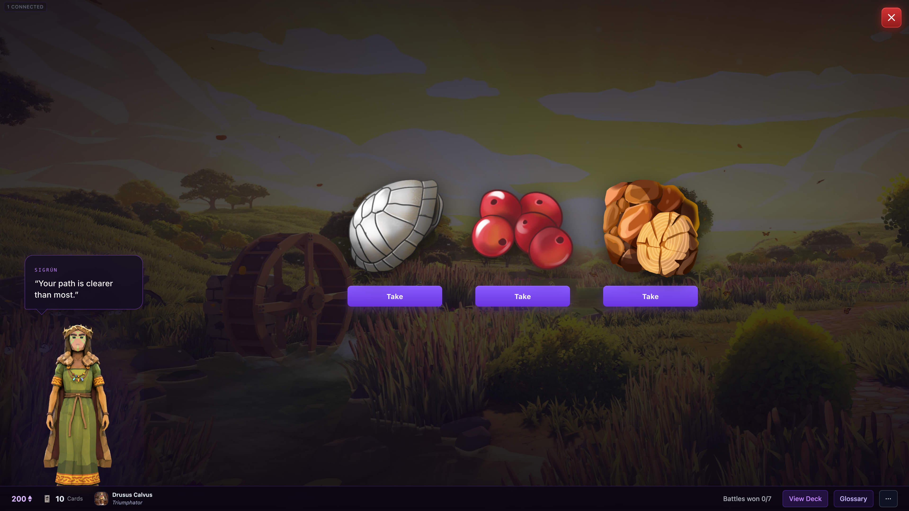

**What it does.** Dreamsign Revelation (guide: **Sigrún**) grants a dreamsign for
free — either a single take-it-or-leave-it offer or, when enhanced (and always in
Sigrún's home dreamscape), a **choice of 3–4**.

**Layout.** Sigrún stands lower-left with a speech bubble. The offered dreamsigns
are shown as a centered row of **art tiles** (no name/text on the tile itself —
all detail is on hover), each with a purple **"Take"** button beneath it. The red
"✕" ("Skip") in the top-right declines.

**What you can click:**

- **A "Take" button** — claims that dreamsign; it plays a glow-and-fly animation
  into the HUD dreamsign row, and the site completes. If the player is already at
  the 12-dreamsign cap, this instead raises the dreamsign-purge overlay (see
  [Edge-Case Overlays](#edge-case-overlays)).
- **Close (✕ / Skip)** — declines the offer and returns to the Dreamscape.

**What you can hover:** **each dreamsign tile** → its hover card (larger art, name,
full effect text) — the only way to read what each offered dreamsign does.

**Enhanced (Winterwake Fjords, Sigrún's home).**

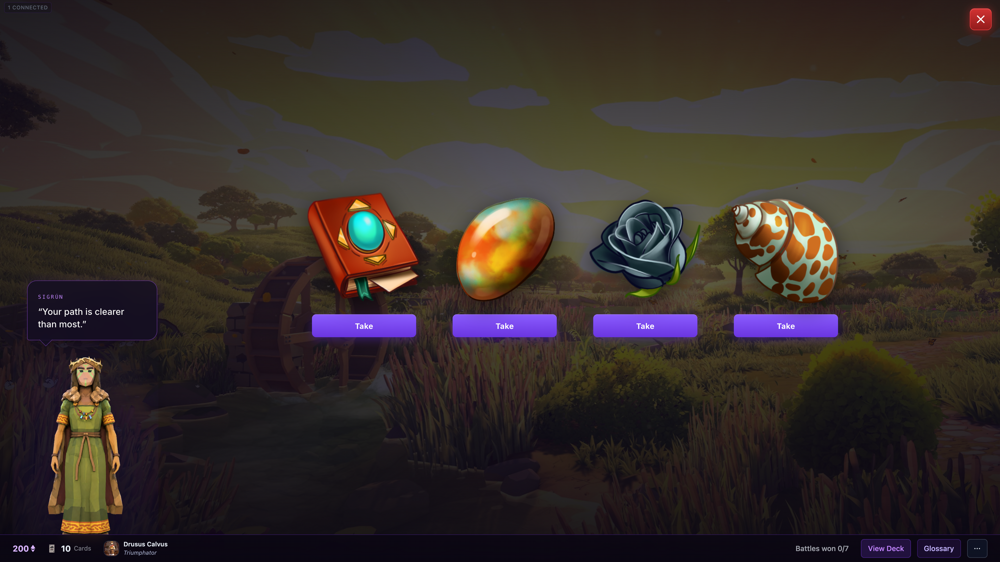

In Sigrún's home dreamscape the offer is enhanced to **four dreamsigns** to choose
from (rather than the standard three, or the single take-it-or-leave-it offer the
site can present elsewhere), tailored to the player's deck. The row layout is the
same, just wider.

**Redesign notes.** Because the tiles are art-only, the only way to read what each
offered dreamsign does is the hover card, which has no touch equivalent. The offer
also varies between a single take-it-or-leave-it and a choice of several, and a
take can trigger the cap-handling overlay.

## Transfiguration

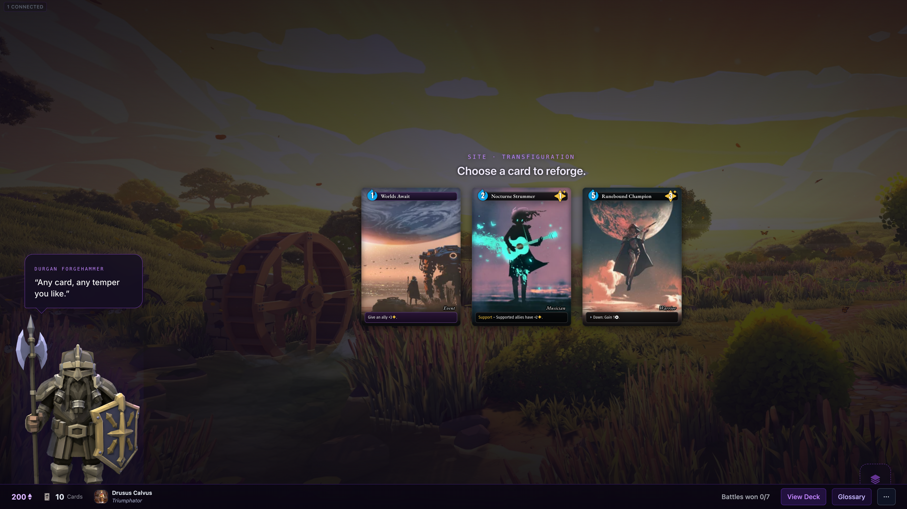

**What it does.** Transfiguration (guide: **Durgan Forgehammer**) rewrites a card
in the player's deck. The site is a **two-phase** flow: first pick a card, then
pick which transfiguration ("form") to apply to it.

**Phase 1 — pick a card.** Durgan stands lower-left with a speech bubble; the
center shows a row of eligible deck cards under a **"Choose a card to reforge"**
heading. Each card is rendered as the *transfigured* version on offer, with its
name and any changed rules text **tinted to the transfiguration's color** and an
**emblem** in its name bar, so the player can preview the change. (Cards already
transfigured are not eligible. The enhanced/home version lets the player pick *any*
card and *any* applicable form.) At the home forge, cards already reforged on
earlier visits appear alongside the eligible candidates as **dimmed tiles with a
colored "Reforged" tag**. If no eligible cards remain, the body collapses to a
short **"No eligible cards to reforge."** notice with a single **"Leave the
forge"** button.

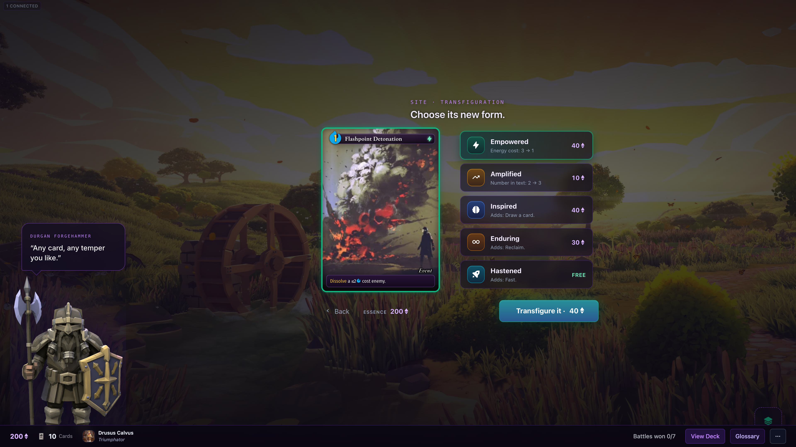

**Phase 2 — pick a form.** After a card is chosen, the screen switches to **"Choose
its new form."**: the selected card sits on the left and a **list of available
forms** appears on the right — each row carrying a **colored form icon**, the form
name (Empowered, Amplified, Inspired, Enduring, Kindled, Hastened, etc.), its
effect, and its **essence cost** ("Free" for the free ones), with a colored accent
per form. Forms the player cannot afford are **dimmed and disabled**. A footer runs
along the bottom: a **"Back"** control (returns to the card list), an **"Essence"
wallet readout** showing the current balance, and the confirm button — **"Transfigure
it · N⬢"** (or just "Transfigure it" for a free form), which reads **"Not enough
essence"** and stays disabled when the chosen form is unaffordable.

**What you can click:**

- **(Phase 1) A card** — selects it and advances to the form list.
- **(Phase 2) A form row**, then **Transfigure** — applies that form (spends
  essence, plays a forge-flash animation, marks the card transfigured).
- **Close (✕)** — declines and returns to the Dreamscape.

**Enhanced (Frostforge, Durgan's home).**

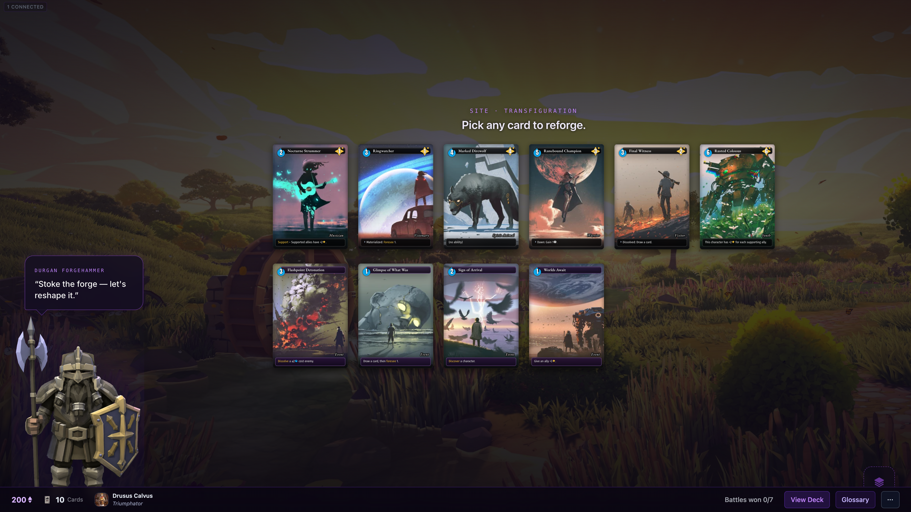

In Durgan's home dreamscape the heading becomes **"Pick any card to reforge."** and
phase 1 shows the player's **entire deck** (in larger card tiles) rather than a
random four, letting the player choose any card — and then any applicable form — to
transfigure.

**Redesign notes.** This is a two-phase flow (pick a card, then pick a form)
rather than a single decision. Each card is *shown as its transfigured self* with a
tint and emblem so the player previews the result; that preview, plus each form's
cost and effect, is dense information that has to stay legible across both phases.

## Duplication

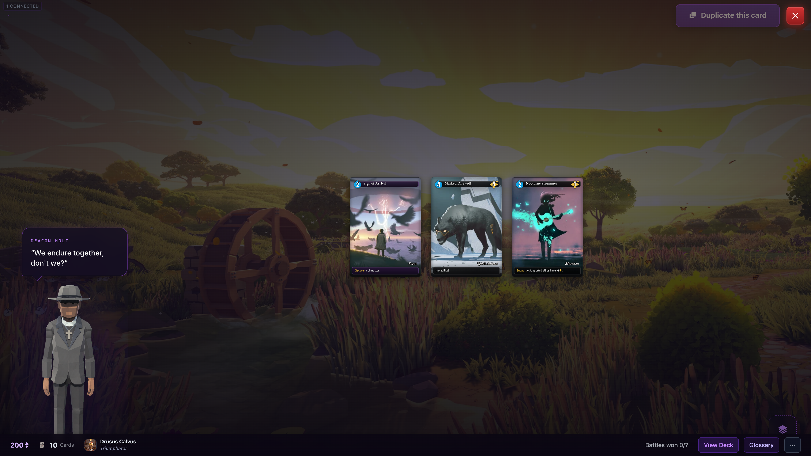

**What it does.** Duplication (guide: **Deacon Holt**) adds a second copy of one
deck card. It offers a small random hand of the player's cards (or the **whole
deck** when enhanced/home) and the player picks one to copy.

**Layout.** Deacon stands lower-left with a speech bubble; the center shows the
candidate cards in a row. Selection is single-choice: clicking a card highlights
it and **dims the other candidates** to emphasize the choice. A **"Duplicate this
card"** confirm button sits in the top-right (next to the red "✕" close). In the
enhanced/home form a small **"Enhanced · Any card"** chip in the top-left signals
that the candidate set is the whole deck.

**What you can click:**

- **A candidate card** — selects it (click again to deselect).
- **Duplicate this card** — adds one copy of the selected card to the deck (a
  particle/lift animation plays, the copy flies to the deck) and completes the site.
- **Close (✕)** — declines and returns to the Dreamscape.

**What you can hover:** **each candidate card** → an enlarged preview.

**Enhanced (Hope's End, Deacon Holt's home).**

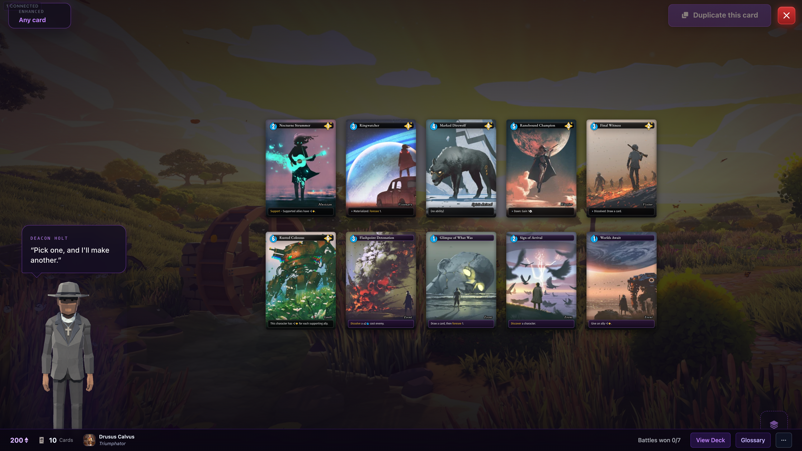

In Deacon's home dreamscape the candidate set expands from a small random hand to
the player's **entire deck** (shown as a multi-row grid, with an "Any card" label),
so the player can copy any card they own.

**Redesign notes.** This is a single-select-then-confirm over a small card set.
The enhanced "whole deck" variant widens that set from a fixed row to the entire
deck, which the fixed-row layout has no room for.

## Purge

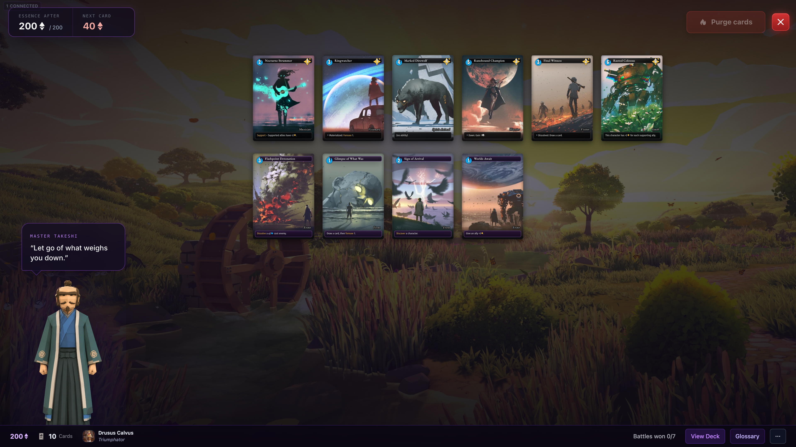

**What it does.** Purge (guide: **Master Takeshi**) lets the player pay escalating
essence to permanently remove cards from the deck (and remove
[banes](../../quests/quests.md#banes) cheaply or free). It is the deck-thinning
site.

**Layout.** A top fixed bar shows the **"Essence after"** readout (balance left
after the current selection, over the starting total) and a **"Next card"** cell
giving the cost of the next removal — which instead reads **"Visit limit reached"**
when the per-visit purge cap is hit or **"Not enough essence"** when the next card
is unaffordable. Master Takeshi stands lower-left with a speech bubble. The body is
a **scrolling grid of every deck card**. Bane cards carry a green **"Free" chip**, a
**"Bane" tag**, and a red selection wash (bane dreamsigns, shown after the deck
cards, are likewise free). The top-right confirm button reads **"Purge cards"** when
nothing is selected and **"Purge N cards · ⬢cost"** once cards are picked; the red
"✕" close sits beside it.

**What you can click:**

- **A card / bane tile** — toggles it for removal. Selected cards get a highlight
  and show the **price they cost at their position in the selection order** (the
  cost escalates with each additional card); cards the player cannot yet afford are
  dimmed. The top bar updates the running total and next-card price live.
- **Purge cards** — spends the essence and permanently removes the selected cards
  (they play a dissolve animation), then returns to the Dreamscape.
- **Close (✕)** — leaves without purging.

**Enhanced (Tsukiren, Master Takeshi's home).**

In Master Takeshi's home dreamscape the top bar gains an **"Enhanced — N% off"**
chip and the per-card prices are discounted accordingly (the "next card" cost in
the bar drops), making deck-thinning cheap in his home.

**Redesign notes.** This is essentially the deck viewer in a selection mode plus a
running cost meter. The full-deck grid, the escalating per-card price, the running
essence summary, and the affordability dimming all have to be visible at once.

## Dream Augury

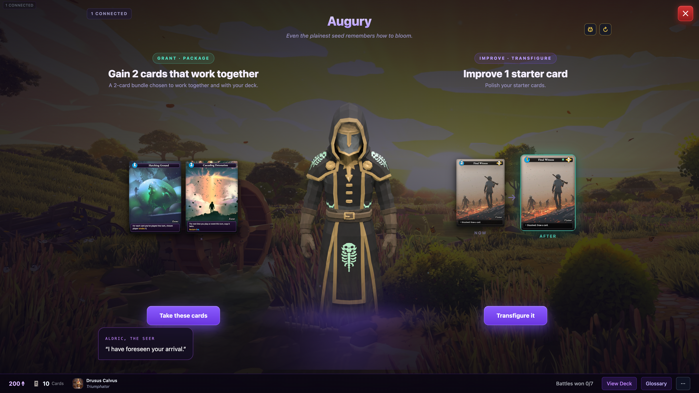

**What it does.** Dream Augury (home guide: **Aldric, the Seer**) is the run's
random-event / curated-reward site. It presents (by default) **two offers**, each a
bundle of cards or other grants tuned to the player's deck, and the player takes
one. This is where the largest, deck-reshaping effects live.

**Layout.** The resident Seer stands at the center of the scene under an
**"Augury"** title. A frosted **guide-caption panel** in the lower-left carries the
guide's name (small uppercase purple label) and a one-line greeting; a small
multiplayer **"N connected"** presence chip sits in the top-left. The two offers
flank the Seer left and right; each offer is a column with a fixed three-part
structure:

- a **header** pinned to the top — a small uppercase **category pill** (e.g.
  "GRANT · POWER GIFT", "IMPROVE · TRANSFIGURE", "REMOVE · PURGE", "SITE · …",
  "DREAMSIGN · DRAFT"), a bold **offer title** (e.g. "Receive Assault Trooper",
  "Draft a mid-cost card"), and a one-line **summary**;
- the offer's **game objects** in the vertical center — the cards, dreamsigns,
  transfigure previews, or map slice the reward is made of (the part that varies
  most by reward type, detailed below);
- a purple **accept button** pinned to the bottom. Both columns share one
  baseline, so the two accept buttons line up no matter how tall each offer's
  objects are.

A developer **reroll** / **force-category** control sits in the top-right.

**Reward types (what the objects look like).** The visual treatment is derived from
the offer's category, so the same column renders very differently depending on what
is being granted. The families:

*Card grants.*

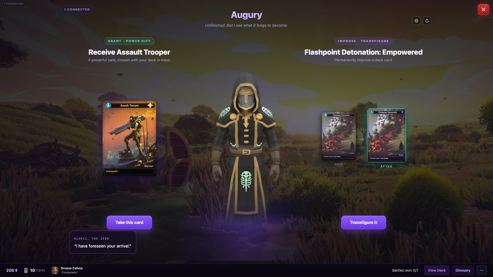

- **Power gift / strong card** (above, left) — one large, pre-targeted card
  centered under a purple glow; the button reads **"Take this card"**.
- **Card bundle** — several pre-targeted cards granted *together*, shown in a row;
  the button reads **"Take these cards"**.
- **Card draft / themed package** (below, left) — a **grid of full cards, pick 1
  of N**. The cards float idle and dimmed until one is clicked; the selected card
  brightens, gains a glowing ring and a **"CHOSEN"** badge, and the others stay
  dimmed, while the button flips from **"Choose"** to **"Take"**.

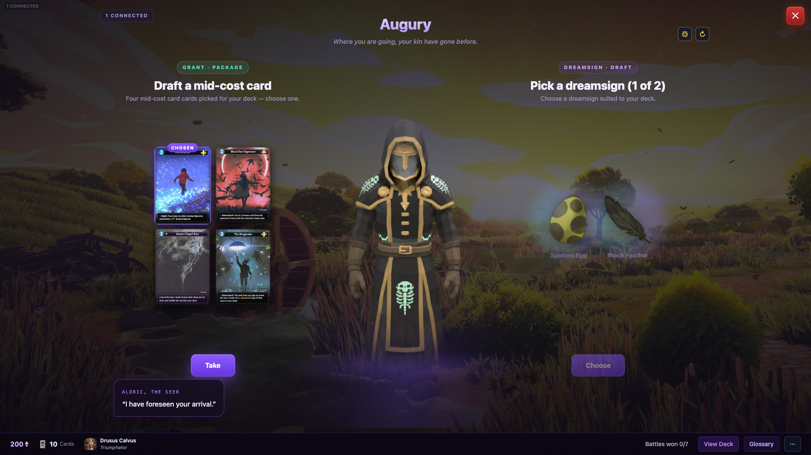

  Two draft variants restyle the grid: a **transfigured draft** shows each
  candidate *already transfigured* (teal ring/badge instead of purple), and a
  **doubled / "keep two copies" draft** renders the selected pick as an
  overlapping **×2 pair** so the doubling reads the moment it is chosen.

*Transfigure / improve.*

- **Transfigure** (first image, right) — a **before → after** pair: the current
  card (dimmed, captioned **"Now"**) → an animated arrow → the rewritten card
  (teal ring, captioned **"After"**), so the player previews the exact change; the
  button reads **"Transfigure it"**. Keyword and tribal-change offers use the same
  before/after treatment.
- **Improve several starters** — one Now → After pair *per card*, stacked
  vertically; the button reads **"Transfigure them"**.

*Duplicate.*

- **Duplicate (single)** — one pre-targeted card shown as an overlapping **×2
  pair** (blue ring + "×2" badge); the button reads **"Duplicate it"**.
- **Duplicate (choose)** — pick one of up to three deck cards; the selected card
  becomes the ×2 pair; the button reads **"Choose"** → **"Duplicate"**.

*Remove.*

- **Purge** — one card under a red circular **✕ seal**, desaturated and darkened
  to read as "to be banished"; the button reads **"Purge it"**.
- **Purge & replace** — the banished card under the red seal → an arrow → a
  **replacement card grid** to pick from; the button reads **"Choose a
  replacement"** → **"Swap"**.

*Dreamsigns.*

- **Dreamsign gift** — a single pre-targeted **dreamsign icon** with its name
  caption (full rules on hover); the button reads **"Take dreamsign"**.
- **Dreamsign draft** (second image, right) — a row of dreamsign icons, **pick
  one**; the selected icon gains a purple ring; the button reads **"Choose"** →
  **"Take"**.

*Map.*

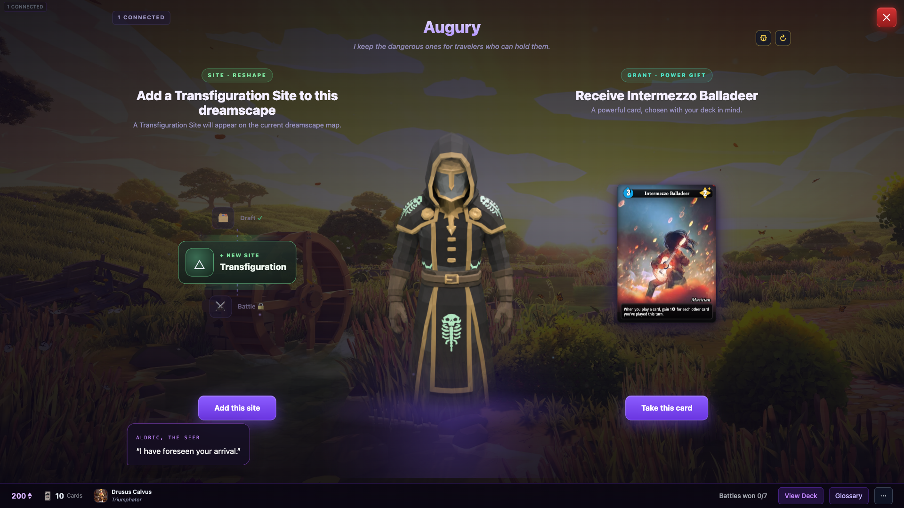

- **Add a site** (above, left) — not cards at all, but a vertical **slice of the
  dreamscape map**: the completed prior node (a **✓**) → a glowing green **"+ NEW
  SITE"** node naming the site type being inserted → the locked **Battle** node (a
  **🔒**). This previews *where* the new site lands in the current dreamscape; the
  button reads **"Add this site"**.

Any offer whose data does not match a known treatment falls back to a plain row of
its raw objects, so a column never blanks out.

**What you can click:**

- **An offer's inline candidate** — for draft / choose / replace / dreamsign-draft
  offers, clicking a candidate selects it (ring + "CHOSEN"/×2 treatment) and
  enables that offer's accept button. Clicking another candidate moves the
  selection.
- **An offer's accept button** — claims that offer (with the selected candidate,
  if the offer required a choice); the chosen reward animates to the deck/HUD and
  the site completes. Pre-targeted offers (power gift, transfigure, purge,
  dreamsign gift, add-site) have no candidate step — the button is live
  immediately. For choose-style offers the button stays **disabled (dimmed,
  not-allowed cursor)** until a candidate is selected.
- **Close (✕)** — declines, when the offer is decline-able.
- *(Developer)* **reroll / force category** — regenerate the encounter, or force a
  specific reward category, for QA.

**What you can hover:** **offer cards** → enlarged previews; **dreamsign icons** →
the dreamsign's full rules text.

**Feedback toasts.** Accepting an offer floats a brief green-bordered **reaction
toast** over the center of the screen with the guide's accept line (e.g. "Well
chosen, traveler!"). If an accept fails (a stale encounter, a mismatch, a missing
offer), a red-bordered **validation toast** appears in the same spot explaining why
the offer could not be taken.

> **Portrait note:** below a narrow width the merchant uses a two-step flow instead
> of the side-by-side columns — a summary overview showing the Seer and the two
> offers as tappable cards, and a per-offer detail view reached by tapping one, with
> a **"‹ Back"** control to return to the overview.

> **Note:** if encounter generation fails, the site shows a "The counter is bare
> tonight. The road remains open." fallback with a single **Walk away** button.

**Enhanced (Wilderveil, Aldric's home).** The merchant screen renders the **same
layout** whether or not the site is enhanced — the encounter generator does not yet
key off the home/enhanced flag, so there is no distinct enhanced screen to capture.
Aldric's home specialty (bigger, more curated rewards) is described in
[quests.md](../../quests/quests.md#home-specialties) but is not currently reflected
in this UI.

**Redesign notes.** Two rich, deck-tuned offers side-by-side make for a wide
layout, each offer bundling a category pill, a title, a description, a cluster of
game objects, and an accept action. The hard part for a redesign is that "the
cluster of game objects" is really a dozen different bespoke treatments (hero
card, card row, pick-one grid, before/after pair, ×2 duplicate pair, red-seal
purge, dreamsign icons, map slice) that all have to read clearly at a glance and,
for the choose-style ones, support an inline selection — a lot of distinct visual
language to carry onto a narrow screen. Card and dreamsign detail is hover-only,
with no touch equivalent, and the reroll/force-category control is developer-only
tooling mixed into the screen.

## Tempting Offer, Gamble & Temporal Fork (Placeholder)

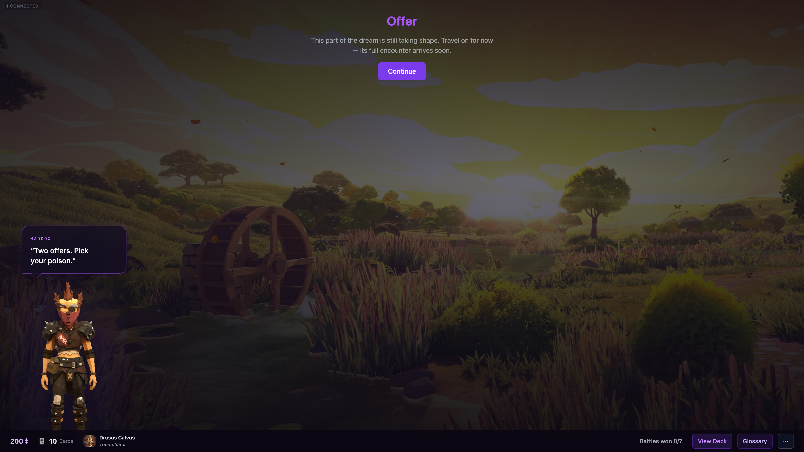

**What it does.** Three site types — **Tempting Offer** (guide: Maddox),
**Gamble** (guide: Gravok), and **Temporal Fork** (guide: "Layaway") — are
defined in the quest design but their encounters are **not yet built**. They all
render the same placeholder screen.

**Layout.** The site's resident guide stands lower-left with a speech bubble, the
site **name** is shown at top center, and the body reads "This part of the dream is
still taking shape. Travel on for now — its full encounter arrives soon." A single
**Continue** button completes the site and returns to the Dreamscape.

**What you can click:** **Continue** — the only control.

**Enhanced (each guide's home dreamscape).**

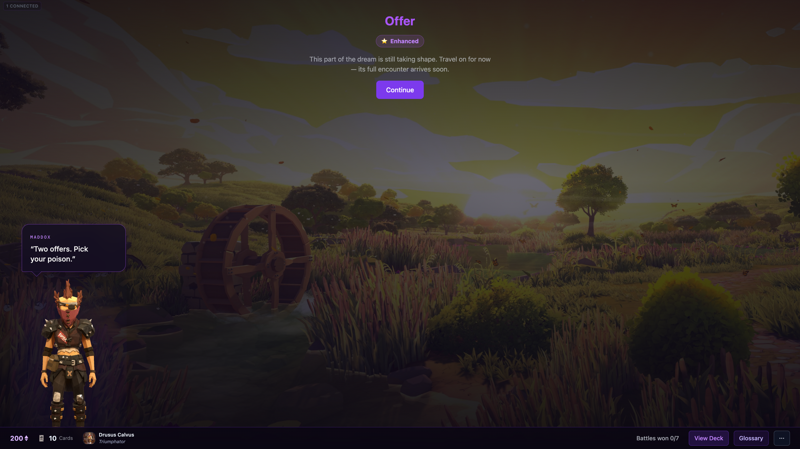

In the resident guide's home dreamscape the placeholder adds a purple **"⭐
Enhanced"** badge beneath the site name; everything else (the dialog, the
placeholder text, the Continue button) is unchanged. This badge is the only
enhanced-vs-regular difference these stubs render today.

**Redesign notes.** These are stubs; their real encounters (a reward-with-a-cost
offer, a push-your-luck wager, a choice of time-based effects) are described in
[quests.md](../../quests/quests.md) but are not yet built, so there is no current
UI to evaluate.

## Essence & Dreamsign Reward (Transient Grants)

Two sites are **non-interactive grants** with no decision to make, so they read as
brief animations rather than screens:

- **Essence site** — grants a fixed amount of essence. The screen shows a single
  glowing, pulsing **essence total counting up** from zero to the granted amount
  (with an "Enhanced" badge when enhanced), then auto-completes back to the
  Dreamscape after ~1.4s. There is nothing to click.
- **Dreamsign Reward site** — grants a specific, pre-disclosed
  [known dreamsign](../../quests/quests.md#known-dreamsigns) (placed on the Atlas
  node in advance). The screen shows the dreamsign (art, name, rules text) with
  **Accept** / **Decline** buttons; accepting flies it into the HUD dreamsign row.
  If the player is at the 12-dreamsign cap, Accept raises the dreamsign-purge
  overlay (see [Edge-Case Overlays](#edge-case-overlays)).

**Redesign notes.** The Essence site is pure feedback (a number going up) with no
decision. The Dreamsign Reward is a one-card accept/decline; its only wrinkle is
the cap handling when the player is already at 12 dreamsigns.

---

# Deck Viewer

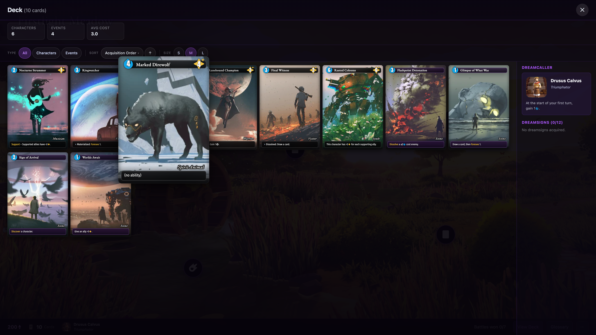

**What it does.** The Deck Viewer is the full-screen overlay (opened from the
HUD's **View Deck**) for inspecting the entire quest deck, with filtering,
sorting, sizing, and a side panel for the Dreamcaller and dreamsigns. It is the
player's main "what's in my deck" reference and is reused (in a selection mode) by
the Purge site.

**Layout.** A header reads **"Deck (N cards)"** with a close (✕). Below it a
**deck summary** (Characters / Events counts and average energy cost) and a
**controls row**: a **type filter** (All / Characters / Events), a **sort**
dropdown (Acquisition Order / Energy Cost / Name / Card Type), an
**ascending/descending** toggle, and **Small / Medium / Large** size presets. The
body is a two-column layout on wide screens:

- **Left — the card grid:** a scrolling grid of the deck's cards (column count
  follows the size preset). Cards carry indicators: a transfiguration glow/emblem
  if transfigured, a 💀 bane badge for banes, and a type-change badge when modified.
- **Right — the sidebar** (wide screens only): a **Dreamcaller** block (portrait,
  name, title, ability text) and a **Dreamsigns** block (the owned dreamsigns,
  N/12, each with art + name + effect). On narrow screens the sidebar becomes
  bottom tabs.

**What you can click:**

- **Filter / sort / direction / size** controls — reshape the grid (size persists
  across sessions).
- **A card tile** — opens a full-screen **card detail overlay** (enlarged art, full
  rules, transfiguration info).
- **Close (✕)** or **Escape** — dismiss the viewer.

**What you can hover:** **a card tile** — Small/Medium tiles enlarge in place;
Large tiles additionally show term-definition popovers for their glossary keywords.

**Redesign notes.** This is a dense browser: a multi-control toolbar (filter,
sort, direction, size), a deck-summary row, a card grid, and a Dreamcaller /
dreamsigns sidebar all share one screen. The two-column desktop layout has no room
on a narrow screen, which is why the sidebar already collapses to bottom tabs. Some
card detail (the term-definition popovers) is gated behind the Large size preset
and hover.

---

# Glossary

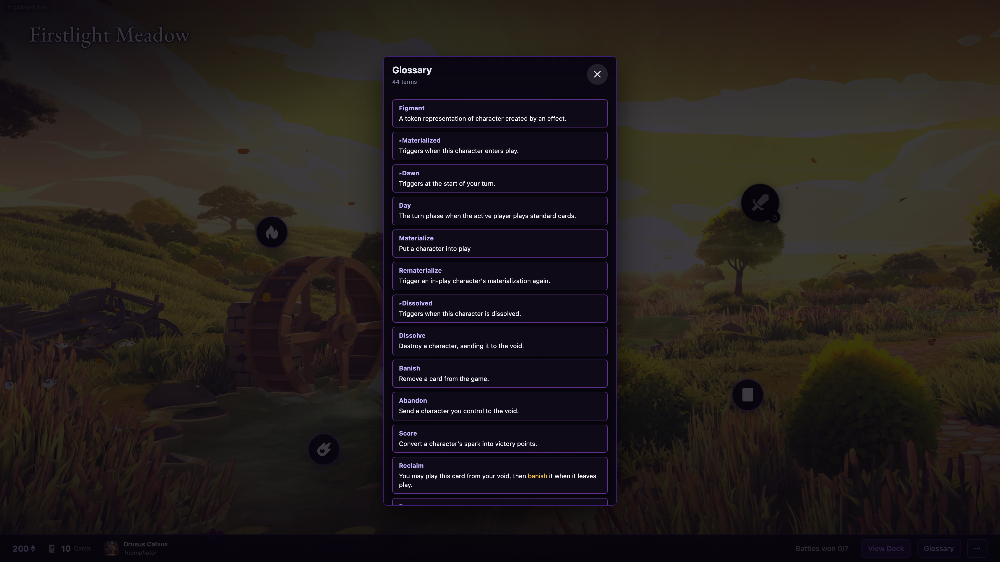

**What it does.** The Glossary (opened from the HUD's **Glossary** button) is a
centered modal listing every game keyword and its definition — the same
term-definition styling used in card hovers, gathered in one place.

**Layout.** A centered panel headed **"Glossary"** with a term-count subtitle and a
close (✕), over a dimmed backdrop. The body is a scrolling list of **definition
cards**, one per term (Figment, Materialized, Dawn, Day, Materialize, Reanimate,
Dissolved, Dissolve, Banish, Abandon, Score, Reclaim, …), each showing the term
name and its definition.

**What you can click:** **Close (✕)**, the **backdrop**, or **Escape** — all
dismiss it.

**Redesign notes.** A simple scrolling reference. Its content is data-driven from
the glossary, so the main concern is the legibility of a potentially long term
list.

---

# Quest Complete (Victory)

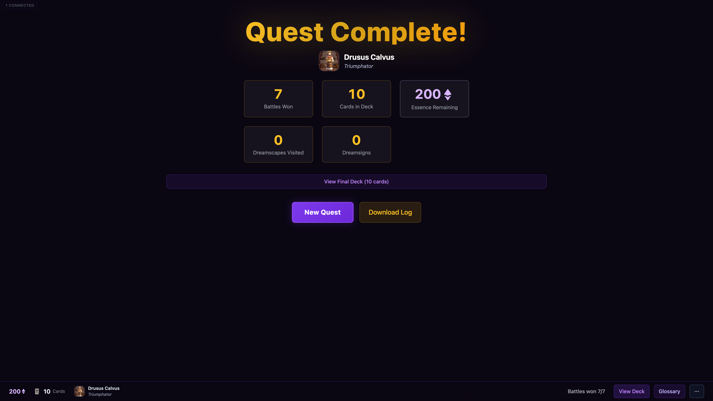

**What it does.** The Quest Complete screen is the run's victory end-state, shown
after the seventh battle (the final boss) is won. It celebrates the run and
summarizes its results.

**Layout.** A centered, vertical composition on a near-black backdrop: a large
gold **"Quest Complete!"** title; the **Dreamcaller** (portrait, name, title)
beneath it; a **stats grid** — **Battles Won**, **Cards in Deck**, **Essence
Remaining**, **Dreamscapes Visited**, **Dreamsigns**; a **"View Final Deck (N
cards)"** toggle; and two action buttons — **New Quest** (purple) and **Download
Log** (gold). The HUD remains at the bottom.

**What you can click:**

- **View Final Deck** — expands a grid of every card in the final deck (toggles to
  **Hide Deck**).
- **New Quest** — resets and starts a fresh run.
- **Download Log** — downloads the run's `quest-log.jsonl`. *(Developer-leaning,
  but harmless on the victory screen.)*

**Redesign notes.** A summary screen built from a stats grid and an optional
final-deck reveal. Its actions mix a player action (**New Quest**) with a developer
one (**Download Log**).

---

# Quest Failed (Defeat)

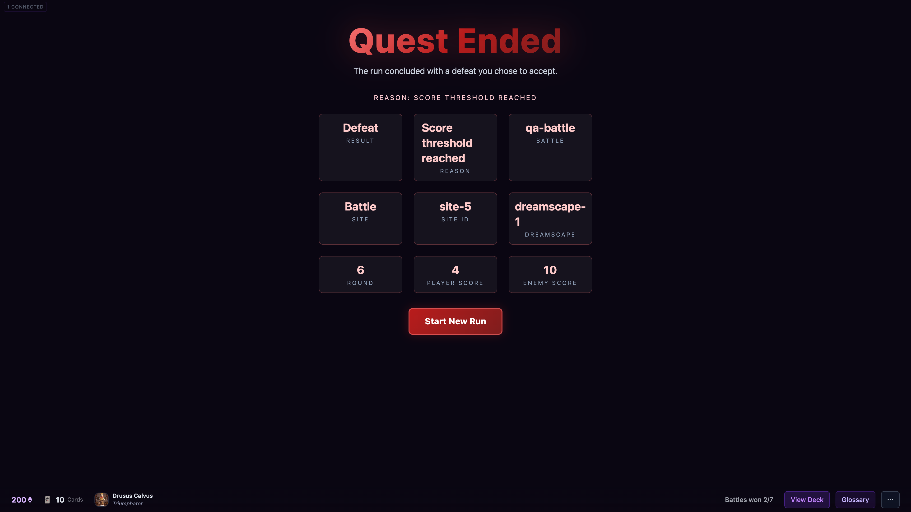

**What it does.** Quest Failed is the run's end-state when a battle is lost (or
drawn) — quests are single-elimination by default, so a loss ends the run. It
reports why the run ended.

**Layout.** A centered, vertical composition: a red **"Quest Ended"** title (or
**"Stalemate"** for a draw), a one-line subtitle, and a **"REASON: …"** badge
(Score threshold reached / Turn limit reached / Forced result). Below is a
**summary grid** of the terminal battle — **Result**, **Reason**, **Battle**,
**Site**, **Site Id**, **Dreamscape**, **Round**, **Player Score**, **Enemy
Score** — and a single **Start New Run** button. The HUD remains at the bottom.

**What you can click:** **Start New Run** — resets and begins a fresh quest. (It is
the only control; there is no continue path, by the single-elimination rule.)

**Redesign notes.** Mostly an information screen with one action. The summary grid
is diagnostic-heavy: alongside player-relevant fields (Result, Reason, scores) it
surfaces raw Battle id and Site id values that are really for debugging.

---

# Developer Surfaces

The quest prototype mixes a layer of developer/debug tooling into the player UI,
reached mainly through the HUD's **"⋯" utility menu**. None of this is part of the
player-facing game; in a mobile redesign it should live on a **separate developer
screen**, not in the live HUD. It is inventoried here so it is accounted for.

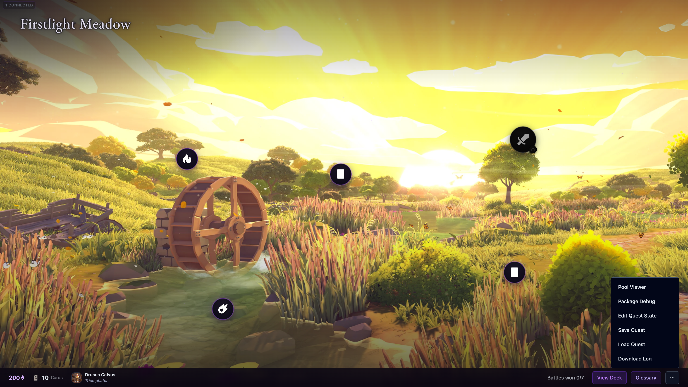

**The "⋯" utility menu** (above) opens from the HUD's right cluster as a small
dropdown with these entries:

- **Pool Viewer** — opens the card-pool browser (below).
- **Package Debug** — opens the draft-package analyzer (shown only when draft data
  is present).
- **Why Cards** — toggles the *Card Source Overlay*, a table showing where each
  card on the current screen came from (starter deck vs. draft-pool copies).
- **Why Journey** — toggles an explanation overlay tracing how the current Dream
  Augury / merchant offers were generated.
- **Edit Quest State** — opens the *Quest Debug Editor*, a tabbed inspector/editor
  for live quest state (deck, essence, dreamsigns, atlas node states).
- **Save Quest** — prompts for a name and saves the run; a small **status toast**
  then appears near the HUD's right cluster confirming the save (e.g. "Saved
  '<name>'.") and auto-dismisses after a few seconds.
- **Load Quest** — replaces the menu with a **Load submenu**: a back control and a
  scrolling list of saved runs (each showing its name, the screen it was saved on,
  and a timestamp), with explicit **loading**, **error**, and **empty** states.
  Choosing a run loads that quest state.
- **Download Log** — downloads `quest-log.jsonl`.

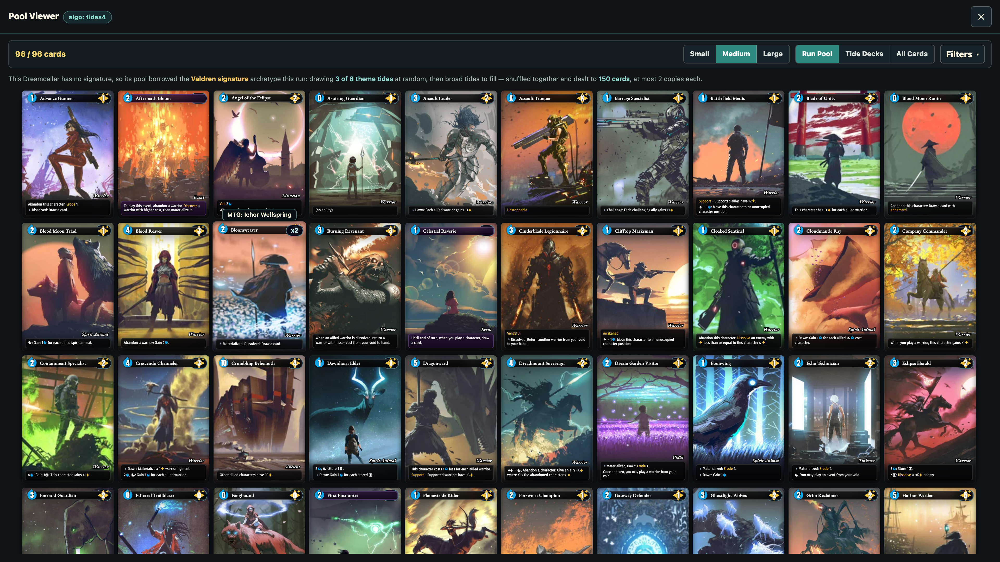

**The Pool Viewer** (above) is the most substantial developer surface: a
full-screen (or floating, draggable) browser of the run's card pools. Its header
carries the pool title and the active **draft algorithm chip** ("algo: tides4");
a **provenance banner** explains how the pool was built (the seed card and growth,
or — for tides4 — which tides were joined and how the pool was dealt). A **source
toggle** switches between **Run Pool**, **Tide Decks**, **Catalog**, and other
views; a **tide selector** (for tides4) lets you inspect each contributing tide. A
**toolbar** offers search, a subtype filter, and Small/Medium/Large sizing, and
the **card grid** shows copy-count badges ("×2") and opens a card detail overlay on
click. It can also display **draft pick history** when viewing a replay record.

The **Quest Debug Editor**, **Package Debug** screen, **Card Source Overlay**, and
**Why Journey** overlay are likewise developer-only inspectors layered over the
current screen.

**Redesign notes.** All of the above is developer tooling reached from the
player-facing HUD's "⋯" menu and layered over live gameplay screens. The Pool
Viewer in particular is a large, complex power tool for reasoning about draft-pool
construction, sitting one tap from the gameplay HUD.

---

# Edge-Case Overlays

Two overlays appear only in specific run conditions and are easy to miss:

- **Starting Deck reveal** — a one-time modal shown immediately after the player
  selects a Dreamcaller, presenting the fixed starter deck as a card grid with a
  single **Continue** to dismiss. It establishes what the player is starting with
  before the first Atlas view. (QA scenes skip it, so it is not screenshotted
  here.)
- **Dreamsign-purge overlay** — raised whenever the player would gain a dreamsign
  while already holding the maximum (12). It blocks the granting site
  (a Dreamsign Market purchase, a Dreamsign Revelation/Reward take) and shows the
  **pending dreamsign** above the player's **current dreamsigns** rendered as
  removable buttons; clicking one removes it and accepts the pending dreamsign,
  while **Cancel** backs out and keeps the current set. It is the enforcement point
  for the dreamsign cap.

**Redesign notes.** Both are blocking, single-decision modals. The
dreamsign-purge overlay is the more significant of the two — it is a real gameplay
decision (which dreamsign to drop), but reading each dreamsign's effect before
choosing depends on the same hover affordance used by the dreamsign row elsewhere,
which has no touch equivalent.
