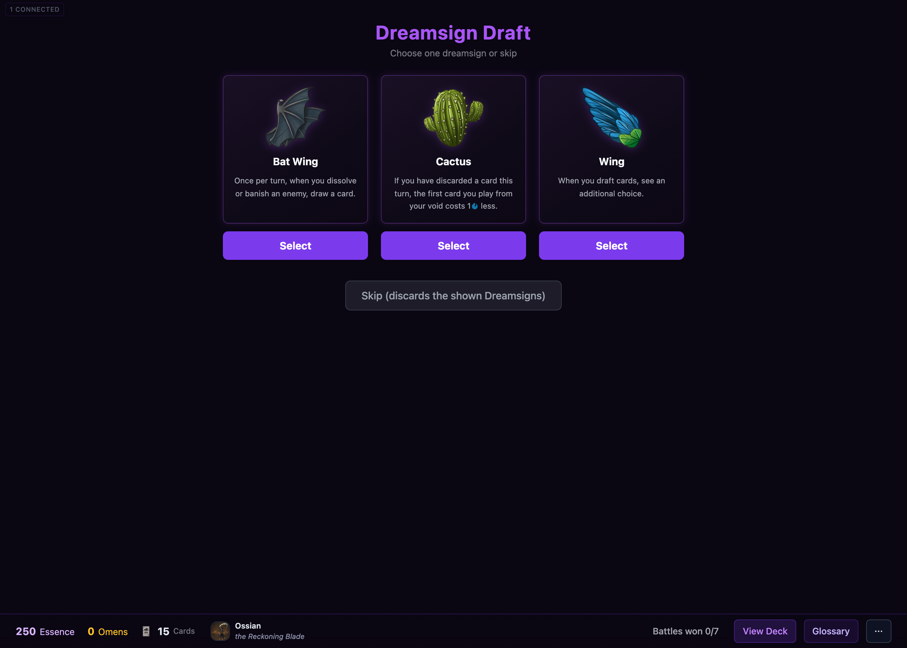
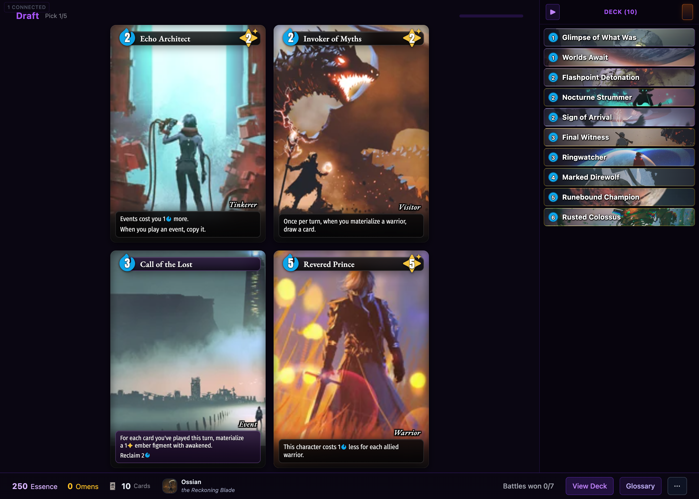
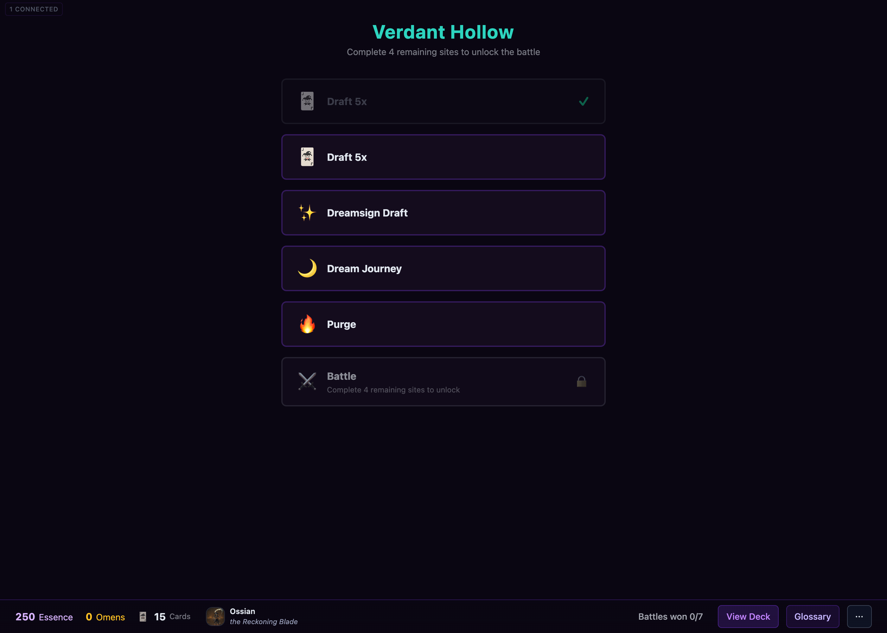
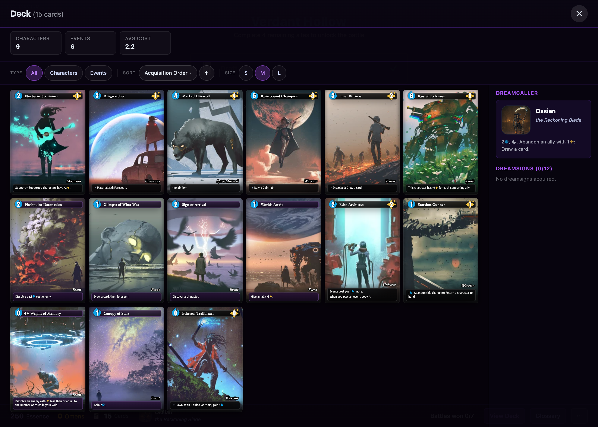
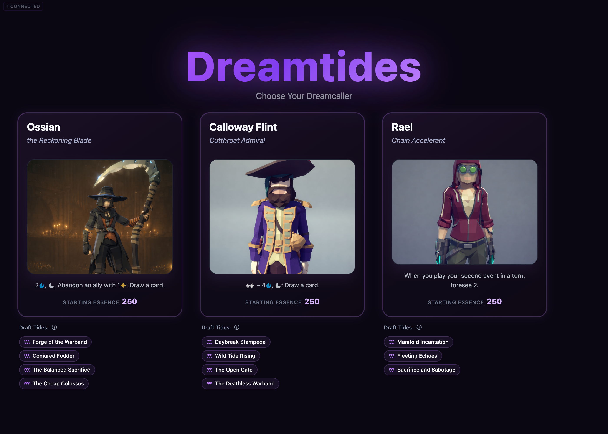

# Dream Journey Screen — Design Mockup Brief

A starting brief for designing the **Dream Journey** screen. It covers the
moment this screen creates for the player, everything that can appear on it, and
an index of rendered game-object art to drop into mockups.

---

## 1. The moment

The Dream Journey is the run's **reward-and-shaping stop** — a calm beat between
battles where the player improves their deck. There's no timer and no fight
here; it's a deliberate choice. The player looks at **two tempting offers**,
weighs them against each other and against the deck they've built so far, and
takes one. They can also walk away and take neither.

This is where a run's identity gets built: it's the place the player adds new
cards, upgrades cards they love, cuts dead weight, gains lasting passives, or
even reshapes the map ahead. So the screen should feel like a moment of
possibility and reward, and — above all — make the two choices easy to compare
at a glance.

**Where it sits.** A quest is a chain of dreamy locations (dreamscapes). Each
location offers a handful of stops to visit in any order — drafts, battles, and
the Dream Journey among them. The player enters the Dream Journey from that
location, makes their choice, and returns to continue the run.

**What's always on screen**

- **Two offers** to choose between, side by side. The two are always different
  *kinds* of reward, so the player is weighing genuinely different options
  (e.g. "gain a powerful new card" vs. "make a card I already have stronger").
- **A way to decline** and leave with neither.
- **The player's running totals** for context — **Essence** (the currency),
  **Omens**, and **Cards** (how big the deck is) — plus the **Dreamcaller**
  (the hero leading this run).

**One thing to design around: legibility.** Each offer needs to read instantly:
*what do I get*, and *what does it touch*. An offer can be as simple as a single
gifted card or as rich as a pick-one-of-four draft or a multi-card package, and
it may act on a card, a dreamsign, the deck as a whole, or the map. The layout
has to hold all of those gracefully without making the player squint.

---

## 2. What an offer can be

There are **17 kinds of offer**, sorted into **6 themes**. A single visit always
shows two offers from two *different* themes, so the player never has to choose
between two near-identical things.

### Theme: GRANT — gain new cards
| Offer | What the player gets |
|---|---|
| Fitting gift | A single card that suits the current deck, handed over directly. |
| Fitting draft | Pick 1 of ~4 cards that suit the deck. |
| Copy draft | Pick 1 of ~4 **extra copies** of cards already in the deck. |
| Power gift | A single strong card, handed over directly. |
| Category draft | Pick 1 of ~4 cards from a named theme (cheap cards, a creature type, etc.). |
| Card package | A small themed pack — pick several from a larger set. |
| Transfigured draft | Pick 1 of ~4 cards that arrive already upgraded (transfigured). |

### Theme: IMPROVE — upgrade a card already owned
| Offer | What the player gets |
|---|---|
| Transfigure | Upgrade one of your cards with a colored transfiguration. |
| Starter transfigure | The same upgrade, aimed at your weak starting cards. |
| Keyword boon | Add an ability (e.g. Reclaim, Fast) to a card you choose. |
| Type change | Change a card's type or creature type to open up new synergies. |

### Theme: REMOVE — thin or swap cards
| Offer | What the player gets |
|---|---|
| Purge | Permanently remove a weak card from the deck. |
| Purge & replace | Remove one card and gain a replacement in the same step. |

### Theme: DUPLICATE
| Offer | What the player gets |
|---|---|
| Duplicate | Add a second copy of one of your strongest cards. |

### Theme: DREAMSIGN — lasting passives
| Offer | What the player gets |
|---|---|
| Dreamsign gift | Gain a single dreamsign that suits the deck. |
| Dreamsign draft | Pick 1 of several dreamsigns. |

### Theme: SITE — reshape the map
| Offer | What the player gets |
|---|---|
| Add site | Add a new reward stop (Shop, Essence, Purge, Transfiguration, Duplication, Dreamsign, Reward, …) to the current location. |

### Things the screen needs to show
Across these offers the screen must present, and make legible at a glance:
**cards** (normal and transfigured), **dreamsign tiles**, a **before/after** on
a card being upgraded, small **keyword / type badges**, **site icons**, and the
run **currencies** (Essence, Omens, Cards).

---

## 3. Stay consistent with the rest of the game

**The Dream Journey is not a blank canvas — it should feel like a sibling of the
screens the player already knows.** The quest already has a clear, calm visual
language across the dreamscape map, the card draft, the dreamsign draft, and the
deck viewer. The redesign should read as obviously part of that same family: a
player moving from a draft into a Dream Journey should feel like they walked into
the next room of the same building, not a different app.

### Reference screens — match these

The Dreamsign Draft and Card Draft are the closest cousins: the Dream Journey is
another "look at a few options, pick one or skip" screen and should borrow their
shape directly.

**Dreamsign Draft** — the offering/chooser pattern to echo most closely:

**Card Draft** — the card-forward chooser, with the deck shown alongside:

**Dreamscape map** — the location the player enters the Dream Journey from:

**Deck viewer** — how the full deck is presented:

**Dreamcaller selection** — the framed-portrait, choose-one treatment at run start:

### The shared visual language

Pull these conventions through to the new design:

- **Dark, dreamy canvas.** Every screen floats on the same near-black,
  deep-indigo field with lots of breathing room. Content is centered and
  uncluttered; nothing fills edge to edge.
- **Title, then a quiet subtitle.** Screens lead with a bold centered title and a
  small muted one-line subtitle beneath it ("Choose one dreamsign or skip",
  "Complete 4 remaining sites…"). Dreamscape titles take on the location's accent
  color (e.g. the teal "Verdant Hollow"); the offering screens use a soft purple
  gradient title.
- **Rounded, glassy panels.** Options and rows are rounded rectangles with a thin
  purple-tinted border and a dark translucent fill. The dreamscape stacks
  full-width rows; the offering screens lay out a row of equal option panels.
- **Purple is the "yes" color.** Primary actions are solid purple buttons with
  white labels (Select / Take / Choose). Secondary or declining actions are quiet
  ghost/outline pills (Skip, Walk away, Glossary). Keep that hierarchy.
- **A persistent bottom HUD.** A fixed bar runs along the bottom of every in-run
  screen: on the left, the run totals with color-coded values — **Essence** in
  lavender, **Omens** in gold, **Cards** with a card glyph — then the Dreamcaller
  portrait and name; on the right, utility buttons (View Deck, Glossary, ⋯). The
  Dream Journey should keep this bar exactly as-is.
- **Cards look the same everywhere.** Cards use one consistent treatment —
  full-bleed art, a translucent title bar, a teal energy badge at top-left, an
  upgrade gem at top-right when transfigured, an italic type label, and a rules
  box — shown larger in choosers and smaller in grids. Reuse it; don't restyle
  cards for this screen.
- **Friendly iconography.** Site and offer types read through simple emoji-style
  icons (🃏 draft, ✨ dreamsign, 🌙 journey, 🔥 purge, ⚔️ battle); completed states
  get a green check, locked states a padlock and a dimmed row.
- **A top-left presence chip.** A small uppercase "1 CONNECTED" pill sits in the
  top-left corner (multiplayer presence). Leave room for it.
